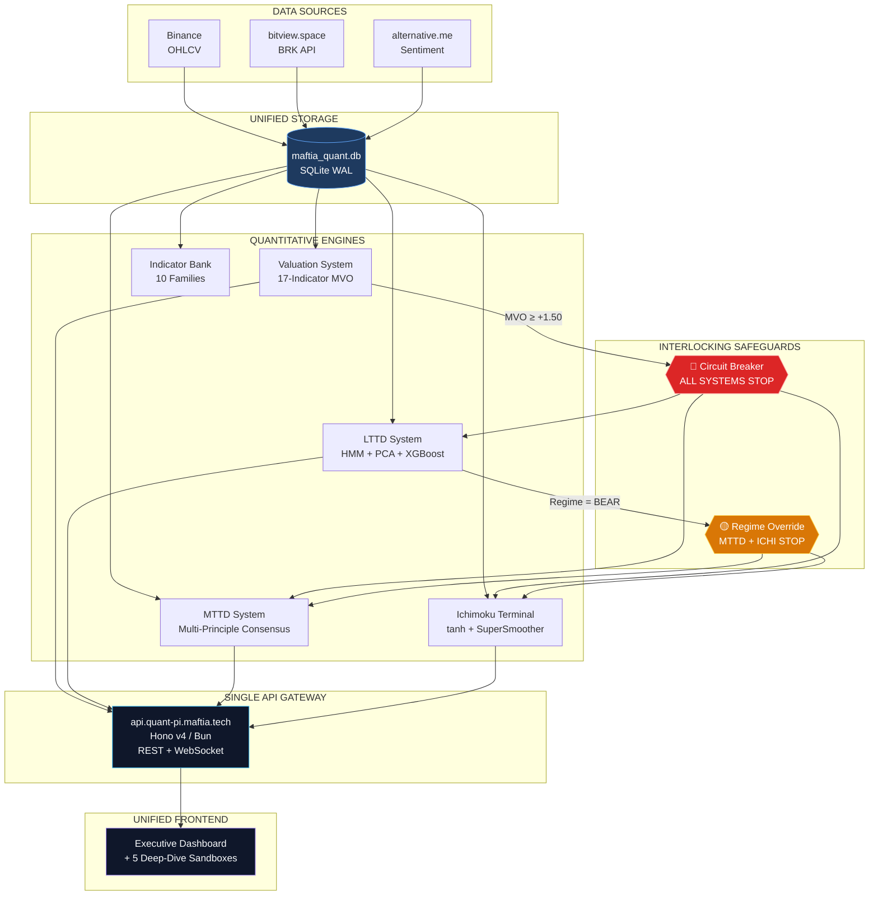

# 🏛️ Maftia Quant — Unified Bitcoin Intelligence Platform

<div align="center">

**A unified quantitative Bitcoin intelligence platform that aggregates 4 independent trading systems and 1 indicator bank into a cohesive architecture with interlocking safeguards.**


</div>

---

## 📊 Market Status (2026-07-08)

| System | Score | Position | Regime |
|--------|-------|----------|--------|
| 🎯 Valuation | `+1.52` | — | High MVO (deep historical discount) |
| 📈 LTTD | `-0.44` | `0.0` | **BEAR** (P=0.73) |
| 📊 MTTD | `-0.99` | `0.0` | IMO blocked |
| 🌊 Ichimoku | `-0.99` | `0.0` | Neutral |
| **🏛️ Consensus** | — | **`0.0`** | **100% Cash / Neutral Mode** |

> ⚠️ All three trend-following systems (LTTD, MTTD, Ichimoku) remain in **strong bearish/neutral state** with **0.0 position exposure**, while the Valuation System registers high scores (above 1.50), reflecting historical deep valuation discounts.

---

## 🏗️ System Architecture



---

## 📁 Repository Structure

```
quant-pi.maftia.tech/
├── .gitignore                          # Standard gitignore (logs, venv, bun, tmp)
├── README.md                           # This file — Master Index & Interlocking Diagram
├── UNIFIED_SYSTEM_ARCHITECTURE.md      # Master Architecture, UI/UX, & Roadmap
├── PROMPT_HANDOFF.md                   # AI Agent Handoff Prompt
└── docs/
    ├── 01_quant_btc_valuation_system.md   # 17-Metric Cycle Valuation Engine
    ├── 02_quant_btc_lttd_system.md        # 6-Layer Regime-Switching LTTD System
    ├── 03_quant_btc_mttd_system.md        # Multi-Principle Consensus MTTD v2
    ├── 04_quant_lttd_ichimoku.md          # Denoised Stationary Tanh Ichimoku
    └── 05_quant_technical_indicator_bank.md # Pine Scraper, Core Library, & 10 Families
```

---

## 🔒 Interlocking Safeguards

The core innovation — systems constrain each other to prevent excessive risk:

| Condition | Source System | Target Systems | Action |
|-----------|--------------|----------------|--------|
| `MVO ≥ +1.50` | Valuation | LTTD, MTTD, Ichimoku | **Circuit Breaker → 0.0 exposure** |
| `Regime = BEAR` | LTTD | MTTD, Ichimoku | **Regime Override → 0.0 exposure** |
| `Regime = SIDEWAYS` | LTTD | MTTD, Ichimoku | **Regime Override → 0.0 exposure** |
| All green | All systems | — | **Consensus → 1.0 exposure** |

---

## 📚 Documentation

| Document | Description | Key Concepts |
|----------|-------------|--------------|
| [Unified Architecture](UNIFIED_SYSTEM_ARCHITECTURE.md) | Master system design, UI/UX, roadmap | Interlocking matrix, HSL tokens, 85px y-axis lock |
| [Valuation System](docs/01_quant_btc_valuation_system.md) | 17-indicator macro cycle engine | Piecewise [-2, +2], SQLite WAL, Hono API |
| [LTTD System](docs/02_quant_btc_lttd_system.md) | Long-term regime detection | HMM, PCA, XGBoost, OU half-life, VIF pruning |
| [MTTD System](docs/03_quant_btc_mttd_system.md) | Medium-term trend consensus | IMO formula, Kaufman ER, Shannon Entropy |
| [Ichimoku Terminal](docs/04_quant_lttd_ichimoku.md) | Denoised Ichimoku signals | tanh, SuperSmoother, 5 formal statistical tests |
| [Indicator Bank](docs/05_quant_technical_indicator_bank.md) | Pine→Python library | agent-browser scraper, 10 statistical families |

---

## 🧮 Key Quantitative Concepts

| Concept | System | Description |
|---------|--------|-------------|
| **CausalFilter** | LTTD, MTTD, Ichimoku | Zero lookahead bias — only past bars referenced |
| **OU Half-Life** | LTTD | Ornstein-Uhlenbeck mean-reversion speed (120–350d) |
| **PCA** | LTTD | Principal Component Analysis — eliminates multicollinearity |
| **VIF Pruning** | LTTD | Variance Inflation Factor > 10 → drop or orthogonalize |
| **Gaussian HMM** | LTTD | 3-state Hidden Markov Model for regime classification |
| **tanh** | MTTD, Ichimoku | Hyperbolic tangent — maps real → [-1, +1] bounded |
| **SuperSmoother** | MTTD, Ichimoku | Ehlers 2-pole IIR filter — noise reduction without lag |
| **Kaufman ER** | MTTD, Ichimoku | Efficiency Ratio — trend strength vs. random walk |
| **Shannon Entropy** | MTTD, Ichimoku | Information-theoretic noise gate |
| **Walk-Forward Optimization** | LTTD | Rolling train/validate/test — no static overfitting |

---

## 🛡️ The Paranoia Principle

> *"Backtested performance is not indicative of future results. In-sample Sharpe 1.29 typically degrades to 0.6–0.9 in live execution."*

All systems use conservative assumptions:

- Transaction costs: 10 bps (0.1%) per round-trip
- Warm-up period: 120 days for indicator initialization
- No fractional sizing — binary 0.0 or 1.0 exposure only
- Circuit breakers and regime overrides prevent catastrophic entries

---

## 🚀 Getting Started

This repository contains **documentation and architecture only**. The actual systems are in separate repositories:

| System | Repository | Port |
|--------|-----------|------|
| Valuation System | `quant-btc-valuation-system` | API `:3000`, FE `:5173` |
| LTTD System | `quant-btc-lttd-system` | API `:8765`, FE `:8766` |
| MTTD System | `quant-btc-mttd-system` | — |
| Ichimoku Terminal | `quant-lttd-ichimoku` | FastAPI `:8000` |
| Indicator Bank | `quant-technical-indicator-bank` | Vite `:5173` |

The unified platform architecture is defined in [`UNIFIED_SYSTEM_ARCHITECTURE.md`](UNIFIED_SYSTEM_ARCHITECTURE.md).

---

## 📈 Roadmap

| Phase | Focus | Timeline |
|-------|-------|----------|
| **Fase 1** | Storage & ETL — `maftia_quant.db` schema, unified pipelines | Weeks 1–3 |
| **Fase 2** | API Gateway — Hono v4 on Bun, REST + WebSocket | Weeks 4–6 |
| **Fase 3** | Frontend Core — Executive Dashboard, crosshair sync, y-axis lock | Weeks 7–10 |
| **Fase 4** | Advanced Sandboxes — 5 deep-dive workspaces | Weeks 11–16 |

---

## 📄 License

MIT © [lutfi-zain](https://github.com/lutfi-zain)

---

<div align="center">

*"The map is not the territory. The model is not the market. But a good interlocking matrix prevents you from walking off a cliff."*

**Maftia Quant · 2026**

</div>
