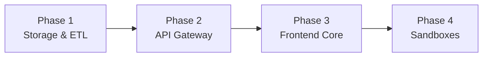

# 🗺️ Maftia Quant — Implementation Roadmap

> **Version:** 1.0.0 · **Date:** 2026-07-08  
> **Repository:** `quant-pi.maftia.tech`  
> **Objective:** Migrate 4 separate Bitcoin quantitative systems into a unified platform with interlocking safeguards.

---

## Overview

This roadmap defines the phased implementation strategy for the Maftia Quant platform. Each phase builds upon the previous one, with clear dependencies and acceptance criteria.

**Total Estimated Timeline:** 16 weeks  
**Systems:** Valuation · LTTD · MTTD · Ichimoku

---

## Phase 1: Storage & ETL (Weeks 1-3)

**Goal:** Unified `maftia_quant.db` with all 4 systems' data, CausalFreshnessGuard, and daily analytics runner.

### Milestones

- [ ] 1.1 SQLite schema designed with all tables
- [ ] 1.2 CausalFreshnessGuard implemented and tested
- [ ] 1.3 Unified OHLCV pipeline fetching from Binance
- [ ] 1.4 LTTD system migrated to unified schema
- [ ] 1.5 Valuation system migrated to unified schema
- [ ] 1.6 MTTD data synced to SQLite
- [ ] 1.7 Ichimoku data synced to SQLite
- [ ] 1.8 Cross-system daily analytics runner operational
- [ ] 1.9 Interlocking safeguards (Circuit Breaker + Regime Override) implemented

### Dependencies

- None (this is the foundation phase)

### Acceptance Criteria

- [ ] `maftia_quant.db` exists with WAL mode enabled
- [ ] `master_ohlcv` table contains BTC/USD daily data from Binance
- [ ] `unified_daily_analytics` table populated with all 4 systems' scores
- [ ] CausalFreshnessGuard rejects stale BRK data
- [ ] Daily runner computes consensus with interlocking safeguards
- [ ] All unit tests pass: `pytest --cov`

---

## Phase 2: API Gateway (Weeks 4-6)

**Goal:** Hono v4 REST API on Bun serving all endpoints with WebSocket streaming.

### Milestones

- [ ] 2.1 Hono v4 project initialized on Bun
- [ ] 2.2 Health check endpoint `/api/v1/ping`
- [ ] 2.3 Market endpoints (`/api/v1/market/*`)
- [ ] 2.4 Valuation endpoints (`/api/v1/valuation/*`)
- [ ] 2.5 LTTD endpoints (`/api/v1/lttd/*`)
- [ ] 2.6 MTTD endpoints (`/api/v1/mttd/*`)
- [ ] 2.7 Ichimoku endpoints (`/api/v1/ichimoku/*`)
- [ ] 2.8 Consensus endpoint with safeguard logic
- [ ] 2.9 WebSocket streaming at `/ws/v1/stream`

### Dependencies

- Phase 1 complete (database must exist)

### Acceptance Criteria

- [ ] API server starts on port 3000
- [ ] All 17 REST endpoints return valid JSON
- [ ] `/api/v1/consensus` applies Circuit Breaker (MVO ≥ +1.50 → 0.0)
- [ ] `/api/v1/consensus` applies Regime Override (BEAR/SIDEWAYS → 0.0)
- [ ] WebSocket pushes updates on analytics refresh
- [ ] All tests pass: `bun test`

---

## Phase 3: Frontend Core (Weeks 7-10)

**Goal:** React + Vite Executive Dashboard with crosshair sync and y-axis lock.

### Milestones

- [ ] 3.1 React + Vite + TypeScript scaffold
- [ ] 3.2 Design token system (HSL CSS variables)
- [ ] 3.3 Executive Dashboard layout (Bento grid)
- [ ] 3.4 Cross-System Confluence Gauge
- [ ] 3.5 Action Banner with safeguard states
- [ ] 3.6 Interactive Summary Table
- [ ] 3.7 BTC Price Chart with regime overlay
- [ ] 3.8 Vertical Crosshair Synchronization
- [ ] 3.9 85px Y-Axis Width Lock

### Dependencies

- Phase 2 complete (API must serve data)

### Acceptance Criteria

- [ ] Dashboard loads at `http://localhost:5173`
- [ ] Confluence Gauge shows system agreement percentage
- [ ] Action Banner reflects current safeguard state
- [ ] Summary Table shows all 4 systems with scores
- [ ] Crosshair sync works across all charts
- [ ] Y-axis aligned at 85px across stacked charts
- [ ] TypeScript strict mode passes: `bun run typecheck`

---

## Phase 4: Advanced Sandboxes (Weeks 11-16)

**Goal:** 4 deep-dive workspaces for system-specific analysis.

### Milestones

- [ ] 4.1 Sandbox framework and navigation
- [ ] 4.2 Valuation Pillar Studio
- [ ] 4.3 LTTD Orthogonal Regime Lab
- [ ] 4.4 MTTD Console
- [ ] 4.5 Ichimoku Terminal

### Dependencies

- Phase 3 complete (dashboard framework must exist)

### Acceptance Criteria

- [ ] All 4 sandboxes accessible from dashboard
- [ ] Valuation Studio: threshold editor with real-time recalculation
- [ ] LTTD Lab: PCA biplot, VIF heatmap, WFO fold results
- [ ] MTTD Console: IMO chart, trade markers, gate heatmap
- [ ] Ichimoku Terminal: 4-component breakdown, cloud overlay, statistical tests

---

## Cross-Phase Dependencies

| Phase | Depends On | Blocks |
|-------|-----------|--------|
| Phase 1 | — | Phase 2 |
| Phase 2 | Phase 1 | Phase 3 |
| Phase 3 | Phase 2 | Phase 4 |
| Phase 4 | Phase 3 | — |

---

## Risk Register

| Risk | Impact | Mitigation |
|------|--------|-----------|
| Schema changes break existing systems | High | Backward-compatible views in Phase 1 |
| API performance degradation | Medium | Load test each phase |
| Frontend complexity explosion | Medium | Modular sandbox architecture |
| Interlocking safeguards bypassed | High | API-layer implementation + unit tests |

---

## Open Questions

1. **Deployment:** Local-only or Docker containerization?
2. **Authentication:** API key for external access?
3. **Data refresh:** Daily cron or manual trigger?
4. **Historical depth:** How far back to backfill? (2016+ recommended)

---

*Last updated: 2026-07-08*  
*Maintainer: lutfi-zain*
