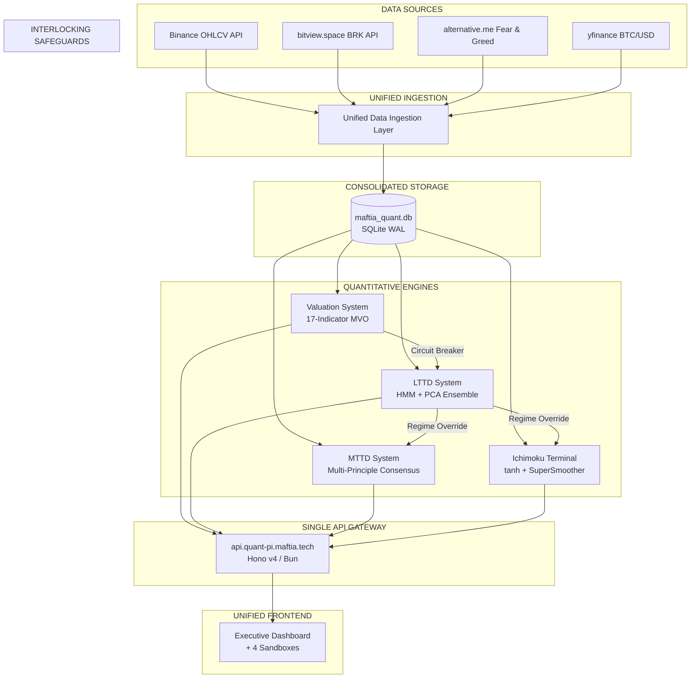
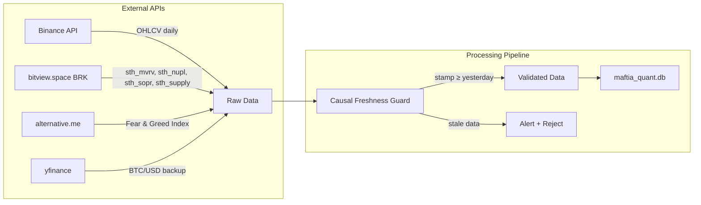
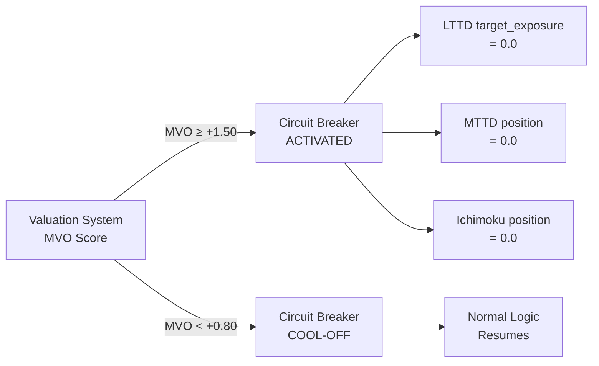
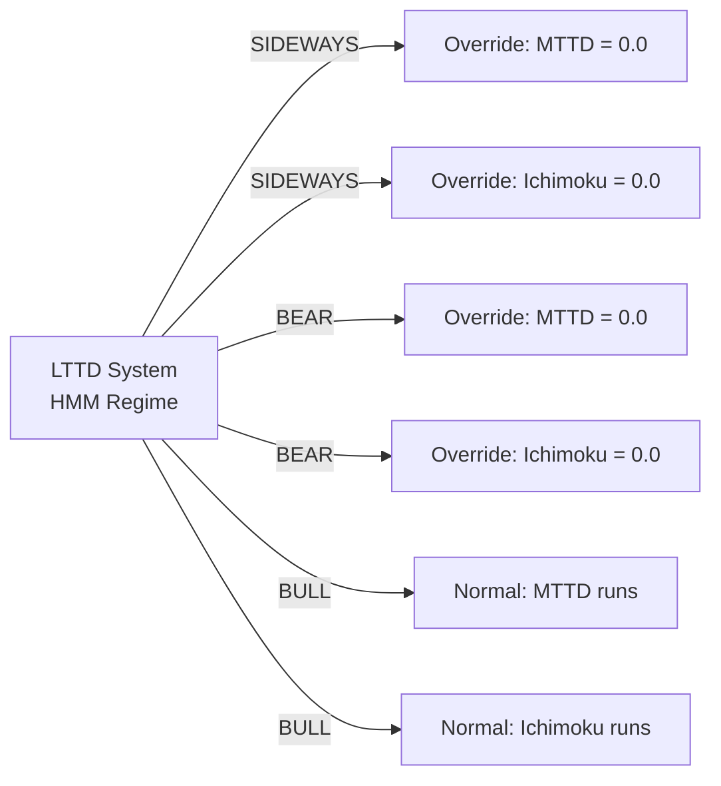
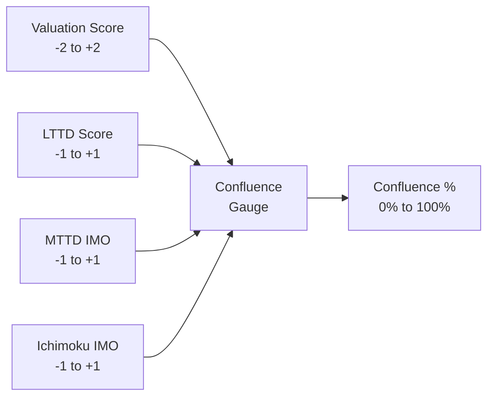
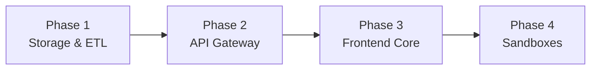
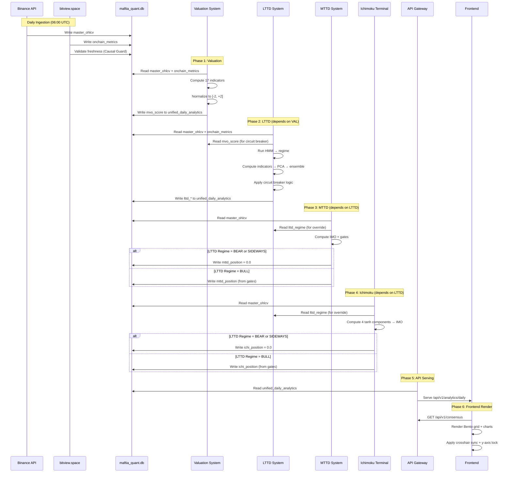

# 🏛️ Maftia Quant — Unified System Architecture

> **Version:** 1.0.0 · **Date:** 2026-07-08  
> **Repository:** `quant-pi.maftia.tech`  
> **Objective:** Consolidate 4 quantitative Bitcoin systems into a single, interlocking intelligence platform with unified data ingestion, consolidated storage, single API gateway, and a premium financial terminal frontend.

---

## Table of Contents

- [1. Executive Summary](#1-executive-summary)
- [2. Current System Inventory](#2-current-system-inventory)
- [3. Unified Data Ingestion & Core Processing](#3-unified-data-ingestion--core-processing)
- [4. Consolidated Storage: maftia_quant.db](#4-consolidated-storage-maftia_quantdb)
- [5. Single API Gateway: api.quant-pi.maftia.tech](#5-single-api-gateway-apiquant-pimaftiatech)
- [6. Interlocking Quantitative Safeguards](#6-interlocking-quantitative-safeguards)
- [7. Proposal: Frontend & 4 Deep-Dive Sandboxes](#7-proposal-frontend--4-deep-dive-sandboxes)
- [8. Desain Layout, UI/UX & Rich Aesthetics System](#8-desain-layout-uiux--rich-aesthetics-system)
- [9. Roadmap Implementasi 4 Fase](#9-roadmap-implementasi-4-fase)
- [10. Mermaid Interlocking Matrix](#10-mermaid-interlocking-matrix)

---

## 1. Executive Summary

The Maftia Quant platform unifies four independent quantitative Bitcoin systems into a cohesive intelligence platform. Each system operates on a distinct time horizon and statistical methodology, but together they form an **interlocking matrix** where the output of one system constrains or amplifies the behavior of another.



---

## 2. Current System Inventory

| # | System | Horizon | Method | Current Port | Storage |
|---|--------|---------|--------|-------------|---------|
| 1 | **Valuation System** | Macro Cycle (multi-year) | 17-indicator MVO piecewise [-2,+2] | API `:3000`, FE `:5173` | `metrics.db` (SQLite WAL) |
| 2 | **LTTD System** | Long-Term (120–350 days) | 3-State HMM + PCA + XGBoost | API `:8765`, FE `:8766` | `lttd.db` (SQLite WAL) |
| 3 | **MTTD System** | Medium-Term (10–120 days) | Multi-principle consensus + IMO | — | `btc_daily.json` + `signals.csv` |
| 4 | **Ichimoku Terminal** | Medium-Term (10–60 days) | tanh Ichimoku + SuperSmoother | FastAPI `:8000` | yfinance cache |

---

## 3. Unified Data Ingestion & Core Processing

### 3.1 Feed Unification



### 3.2 Causal Freshness Guard

Every data ingestion point enforces a **Causal Freshness Guard** — a critical anti-corruption layer:

```python
def validate_freshness(response, series_name):
    """
    BRK data is derived from confirmed on-chain state.
    The stamp field ≠ datetime.now(). Always check freshness.
    """
    stamp = parse(response['stamp'])
    yesterday = datetime.now() - timedelta(days=1)
    if stamp < yesterday:
        raise StaleDataError(
            f"{series_name} data stale: stamp={stamp}, expected ≥ {yesterday}"
        )
    return response['data']
```

### 3.3 Unified OHLCV Pipeline

```python
# Single source of truth for BTC daily OHLC
class UnifiedOHLCVPipeline:
    """Fetches BTC/USD daily OHLCV from Binance, validates, and stores."""
    
    def fetch(self, symbol="BTCUSDT", interval="1d"):
        raw = binance_api.get_klines(symbol, interval)
        validated = self.apply_causal_filter(raw)  # confirmed bars only
        return self.store(validated)
```

---

## 4. Consolidated Storage: maftia_quant.db

### 4.1 Schema Design

```sql
-- ═══════════════════════════════════════════════════════════
-- MASTER OHLCV TABLE (Single source for all systems)
-- ═══════════════════════════════════════════════════════════
CREATE TABLE master_ohlcv (
    date         TEXT PRIMARY KEY,
    open         REAL NOT NULL,
    high         REAL NOT NULL,
    low          REAL NOT NULL,
    close        REAL NOT NULL,
    volume       REAL,
    source       TEXT DEFAULT 'binance',  -- 'binance' | 'yfinance'
    fetched_at   TEXT DEFAULT CURRENT_TIMESTAMP
);

-- ═══════════════════════════════════════════════════════════
-- UNIFIED DAILY ANALYTICS (All systems write here)
-- ═══════════════════════════════════════════════════════════
CREATE TABLE unified_daily_analytics (
    date                   TEXT PRIMARY KEY,
    
    -- Valuation System outputs
    mvo_score               REAL,          -- Master Valuation Oscillator ∈ [-2, +2]
    mvo_pillar_fundamental  REAL,
    mvo_pillar_technical    REAL,
    mvo_pillar_sentiment    REAL,
    
    -- LTTD System outputs
    lttd_score              REAL,          -- ∈ [-1.0, +1.0]
    lttd_regime             TEXT,          -- 'BULL' | 'BEAR' | 'SIDEWAYS'
    lttd_p_bull             REAL,
    lttd_p_bear             REAL,
    lttd_p_sideways         REAL,
    lttd_exposure           REAL,          -- 0.0 or 1.0
    lttd_circuit_breaker    INTEGER,       -- 0 or 1
    
    -- MTTD System outputs
    mttd_imo                REAL,          -- Integrated Market Oscillator
    mttd_position           REAL,          -- 0.0 or 1.0
    mttd_er                 REAL,          -- Efficiency Ratio
    mttd_entropy            REAL,          -- Shannon Entropy
    
    -- Ichimoku System outputs
    ichi_imo                REAL,          -- Composite Ichimoku Oscillator
    ichi_position           REAL,          -- 0.0 or 1.0
    ichi_s_tk               REAL,
    ichi_s_cloud            REAL,
    ichi_s_future           REAL,
    ichi_s_chikou           REAL,
    
    -- Cross-system
    consensus_score         REAL,          -- Aggregated signal
    consensus_exposure      REAL,          -- Final position
    
    -- On-chain metrics
    sth_mvrv               REAL,
    sth_nupl               REAL,
    sth_sopr_24h           REAL,
    sth_supply_in_profit   REAL,
    
    -- Metadata
    data_as_of              TEXT
);

-- ═══════════════════════════════════════════════════════════
-- UNIFIED COMPONENT SIGNALS (Granular indicator-level data)
-- ═══════════════════════════════════════════════════════════
CREATE TABLE unified_component_signals (
    date            TEXT,
    system          TEXT,       -- 'valuation' | 'lttd' | 'mttd' | 'ichimoku'
    component       TEXT,       -- indicator/component name
    score           REAL,       -- normalized output
    raw_value       REAL,       -- pre-normalization value
    PRIMARY KEY (date, system, component)
);

-- ═══════════════════════════════════════════════════════════
-- INDEXES for query performance
-- ═══════════════════════════════════════════════════════════
CREATE INDEX idx_unified_date ON unified_daily_analytics(date);
CREATE INDEX idx_unified_regime ON unified_daily_analytics(lttd_regime);
CREATE INDEX idx_unified_system ON unified_component_signals(system);
CREATE INDEX idx_unified_system_date ON unified_component_signals(system, date);
```

---

## 5. Single API Gateway: api.quant-pi.maftia.tech

### 5.1 Technology

- **Runtime:** Bun (JavaScript runtime)
- **Framework:** Hono v4 (web framework)
- **Mode:** REST `/api/v1/...` + WebSocket Server (real-time updates)

### 5.2 Endpoint Design

```
Base URL: https://api.quant-pi.maftia.tech
```

| Endpoint | Method | Description |
|----------|--------|-------------|
| `/api/v1/ping` | GET | Health check + system status |
| `/api/v1/market/ohlc` | GET | Unified BTC/USD OHLCV |
| `/api/v1/market/onchain` | GET | On-chain metrics (4 series) |
| `/api/v1/valuation/composite` | GET | Master Valuation Oscillator |
| `/api/v1/valuation/pillars` | GET | Per-pillar scores |
| `/api/v1/lttd/regime` | GET | HMM regime + posteriors |
| `/api/v1/lttd/score` | GET | LTTD Final Score time-series |
| `/api/v1/lttd/exposure` | GET | Current exposure + circuit breaker |
| `/api/v1/mttd/imo` | GET | Integrated Market Oscillator |
| `/api/v1/mttd/position` | GET | Current MTTD position |
| `/api/v1/mttd/gates` | GET | Gate status (ER, Entropy, Cloud) |
| `/api/v1/ichimoku/imo` | GET | Composite Ichimoku Oscillator |
| `/api/v1/ichimoku/position` | GET | Current Ichimoku position |
| `/api/v1/ichimoku/components` | GET | 4 sub-component scores |
| `/api/v1/consensus` | GET | Cross-system consensus score |
| `/api/v1/analytics/daily` | GET | Full daily analytics row |
| `/ws/v1/stream` | WS | Real-time data push |

### 5.3 Hono v4 Implementation Sketch

```typescript
import { Hono } from 'hono'
import { cors } from 'hono/cors'
import { Database } from 'bun:sqlite'

const app = new Hono()
const db = new Database('maftia_quant.db', { readonly: true })

app.use('/api/*', cors())

// Unified daily analytics
app.get('/api/v1/analytics/daily', (c) => {
    const { from, to } = c.req.query()
    const rows = db.query(`
        SELECT * FROM unified_daily_analytics 
        WHERE date BETWEEN ? AND ?
        ORDER BY date ASC
    `).all(from || '2016-01-01', to || '2099-12-31')
    return c.json({ data: rows })
})

// Current regime + exposure
app.get('/api/v1/consensus', (c) => {
    const latest = db.query(`
        SELECT * FROM unified_daily_analytics 
        ORDER BY date DESC LIMIT 1
    `).get()
    return c.json(latest)
})
```

---

## 6. Interlocking Quantitative Safeguards

The core innovation of the unified system is the **interlocking matrix** — where outputs of one system constrain the behavior of another. This prevents any single system from taking excessive risk.

### 6.1 Circuit Breaker: Valuation → LTTD



**Mechanism:** When the Valuation System detects macro bubble exhaustion (`MVO ≥ +1.50`), it activates a **hard circuit breaker** that forces all trend-following systems (LTTD, MTTD, Ichimoku) to hold `0.0` exposure — regardless of their internal signals. The breaker only deactivates when MVO cools below `+0.80`.

### 6.2 Regime Override: LTTD → MTTD & Ichimoku



**Mechanism:** The LTTD System's Gaussian HMM regime detection has veto power over medium-term systems:

| LTTD Regime | MTTD Override | Ichimoku Override | Reason |
|-------------|---------------|-------------------|--------|
| **BULL** | No override | No override | Trend-following allowed |
| **BEAR** | Position → `0.0` | Position → `0.0` | Trend-following against trend is dangerous |
| **SIDEWAYS** | Position → `0.0` | Position → `0.0` | Whipsaw prevention |

### 6.3 Consensus Aggregation Logic

```python
def compute_consensus_exposure(valuation, lttd, mttd, ichimoku):
    """
    Final exposure is the intersection of all system constraints.
    Any system can veto to 0.0, but no system can override to 1.0 alone.
    """
    # Tier 1: Circuit breaker (highest priority)
    if valuation.mvo >= 1.50:
        return 0.0  # Hard stop
    
    # Tier 2: LTTD regime override
    if lttd.regime in ('BEAR', 'SIDEWAYS'):
        return 0.0  # Regime veto
    
    # Tier 3: Consensus voting (remaining systems)
    votes = [mttd.position, ichimoku.position]
    consensus = sum(votes) / len(votes)
    
    # Tier 4: Binary threshold
    return 1.0 if consensus >= 0.5 else 0.0
```

### 6.4 Interlocking Matrix Summary

| | Valuation MVO | LTTD Regime | MTTD Gate | Ichimoku Gate | **Final** |
|---|:---:|:---:|:---:|:---:|:---:|
| MVO ≥ +1.50 | 🔴 STOP | — | — | — | **0.0** |
| Regime = BEAR | — | 🔴 VETO | — | — | **0.0** |
| Regime = SIDEWAYS | — | 🔴 VETO | — | — | **0.0** |
| IMO < threshold | — | — | 🟡 BLOCKED | — | **0.0** |
| ER < 0.20 | — | — | 🟡 BLOCKED | — | **0.0** |
| Entropy > 2.30 | — | — | 🟡 BLOCKED | — | **0.0** |
| ICHI cloud fail | — | — | — | 🟡 BLOCKED | **0.0** |
| All green | 🟢 | 🟢 BULL | 🟢 PASS | 🟢 PASS | **1.0** |

---

## 7. Proposal: Frontend & 4 Deep-Dive Sandboxes

### 7.1 Executive Dashboard (Main View)

**Layout: Bento Grid Header**

```
┌─────────────────────────────────────────────────────────────────┐
│                    MAFTIA QUANT INTELLIGENCE                     │
│                    BTC: $62,681  │  2026-07-08                  │
├──────────────────┬──────────────────┬───────────────────────────┤
│  CROSS-SYSTEM    │  ACTION BANNER   │   REGIME GAUGE            │
│  CONFLUENCE      │  100% CASH       │   BULL ████░░ BEAR        │
│  GAUGE           │  NEUTRAL MODE    │   P_Bull: 0.12            │
│  ████████░░ 45%  │                  │   P_Bear: 0.73            │
├──────────────────┴──────────────────┴───────────────────────────┤
│                    INTERACTIVE SUMMARY TABLE                     │
│                                                                 │
│  System     │ Score   │ Position │ Gate Status │ Last Update    │
│  Valuation  │ +1.52   │ —        │ Normal      │ 2026-07-08     │
│  LTTD       │ -0.44   │ 0.0      │ BEAR regime │ 2026-07-08     │
│  MTTD       │ -0.99   │ 0.0      │ IMO blocked │ 2026-07-08     │
│  Ichimoku   │ -0.99   │ 0.0      │ Neutral     │ 2026-07-08     │
├─────────────────────────────────────────────────────────────────┤
│                                                                 │
│  [BTC Price Chart with Cross-System Overlay]                    │
│  • Regime bands from LTTD (green/red/gray)                     │
│  • MTTD buy/sell markers                                        │
│  • Ichimoku cloud overlay                                       │
│  • Valuation MVO heatmap (bottom sub-panel)                     │
│                                                                 │
└─────────────────────────────────────────────────────────────────┘
```

### 7.2 Cross-System Confluence Gauge

A radial gauge showing the degree of agreement across all 4 systems:



- **100%:** All systems agree (rare, high-conviction signals)
- **75%:** Strong majority agreement
- **50%:** Mixed signals (caution)
- **25%:** Conflicting signals (no trade)

### 7.3 Action Banner

A prominent status bar that communicates the current position in plain language:

| Condition | Banner Display | Color |
|-----------|---------------|-------|
| MVO ≥ +1.50 | `🔴 CIRCUIT BREAKER ACTIVE — ALL SYSTEMS HALTED` | Crimson |
| LTTD = BEAR | `🟡 BEAR REGIME — ALL EXPOSURE HALTED` | Amber |
| LTTD = SIDEWAYS | `🟡 SIDEWAYS — NO TRADE ZONE` | Amber |
| All systems 1.0 | `🟢 FULL EXPOSURE — ALL SYSTEMS ALIGNED` | Emerald |
| Default | `⚪ 100% CASH — NEUTRAL MODE` | Gray |

### 7.4 Interactive Summary Table

Sortable, filterable table showing per-system status with drill-down capability.

---

### 7.5 Four Deep-Dive Sandboxes

Each sandbox is a dedicated full-screen workspace for deep analysis of one system.

#### Sandbox 1: Valuation Pillar Studio

```
┌──────────────────────────────────────────────────────────────┐
│  VALUATION PILLAR STUDIO                                      │
│                                                               │
│  ┌─────────────────┬─────────────────┬─────────────────┐     │
│  │ FUNDAMENTAL      │ TECHNICAL       │ SENTIMENT       │     │
│  │ MVRV Z-Score     │ Pi Cycle        │ Fear & Greed    │     │
│  │ NUPL             │ 200W MA         │ Google Trends   │     │
│  │ SOPR             │ RHODL           │ Funding Rate    │     │
│  │ Stock-to-Flow     │ Golden Ratio    │ Social Volume   │     │
│  │ Active Address   │ Bull-Bear       │ Open Interest   │     │
│  │ Exchange Reserve │                 │                 │     │
│  │ LTH Supply       │                 │                 │     │
│  └─────────────────┴─────────────────┴─────────────────┘     │
│                                                               │
│  [Master Composite Oscillator Chart]                          │
│  [Custom Threshold Editor per Metric]                         │
│  [Historical MVO vs BTC Price Backtest]                       │
└──────────────────────────────────────────────────────────────┘
```

**Features:**

- Draggable threshold lines per metric
- Real-time score recalculation
- Custom SD multiplier overrides
- Pillar contribution breakdown

#### Sandbox 2: LTTD Orthogonal Regime Lab

```
┌──────────────────────────────────────────────────────────────┐
│  LTTD REGIME LAB                                              │
│                                                               │
│  ┌──────────────────────────────────────────────────────┐    │
│  │ Regime Banner: BEAR (P=0.73)                         │    │
│  │ Score Gauge: -0.44 ──────────────────────|──→ +1.0   │    │
│  │ Circuit Breaker: INACTIVE                          │    │
│  └──────────────────────────────────────────────────────┘    │
│                                                               │
│  [HMM Regime Timeline — Bull/Bear/Sideways history]           │
│  [PCA Component Loadings + Variance Explained]                │
│  [VIF Heatmap — Indicator Correlation Matrix]                 │
│  [WFO Fold Results Table — Train/Val/Test Sharpe per fold]   │
│  [On-Chain Metrics Panel — 4 STH metrics with thresholds]   │
│  [Indicator Stack — 4 active signals + binary scores]        │
└──────────────────────────────────────────────────────────────┘
```

**Features:**

- HMM posterior probability visualization
- PCA biplot (PC1 vs PC2)
- Real-time VIF computation
- WFO fold-by-fold performance breakdown

#### Sandbox 3: MTTD Console

```
┌──────────────────────────────────────────────────────────────┐
│  MTTD CONSOLE                                                 │
│                                                               │
│  ┌──────────────────────────────────────────────────────┐    │
│  │ IMO: -0.99 ──────────────────────────|──→ +1.0       │    │
│  │ Position: 0.0 (FLAT)                                │    │
│  │ ER: 0.08 (BLOCKED) │ Entropy: 2.81 (BLOCKED)       │    │
│  │ Cloud: FAIL │ Chikou: -0.82 (EXIT)                  │    │
│  └──────────────────────────────────────────────────────┘    │
│                                                               │
│  [IMO Time-Series with Gate Annotations]                      │
│  [Entry/Exit Trade Markers on Price Chart]                    │
│  [10 Statistical Families — Contribution Radar]               │
│  [Walk-Forward Stitched Equity Curve]                         │
│  [Gate Blocker Heatmap — Which gate blocked, when]           │
└──────────────────────────────────────────────────────────────┘
```

#### Sandbox 4: Ichimoku Terminal

```
┌──────────────────────────────────────────────────────────────┐
│  ICHIMOKU TERMINAL                                            │
│                                                               │
│  ┌──────────────────────────────────────────────────────┐    │
│  │ 4-Component Breakdown:                               │    │
│  │ S_TK: +0.32 │ S_Cloud: -0.15 │ S_Future: -0.41     │    │
│  │ S_Chikou: -0.82                                      │    │
│  │ IMO: -0.99 │ Position: 0.0 (NEUTRAL)                │    │
│  └──────────────────────────────────────────────────────┘    │
│                                                               │
│  [BTC Price with tanh-normalized Ichimoku Cloud Overlay]      │
│  [4 Sub-Component Stacked Area Chart]                         │
│  [SuperSmoother Parameter Tuner (l=4, l=7)]                  │
│  [5-Gate Status Dashboard with Visual Gates]                  │
│  [Statistical Test Results Panel — ADF, KS, t-test, CI]      │
└──────────────────────────────────────────────────────────────┘
```

---

## 8. Desain Layout, UI/UX & Rich Aesthetics System

### 8.1 Design Theme: High-End Quantitative Financial Terminal

A fusion of:

- **Bloomberg Terminal** — data density, professional information hierarchy
- **TradingView** — interactive charting, crosshair synchronization
- **Glassmorphism** — translucent panels, depth through layering
- **Obsidian Dark-Tech UI** — minimal, dark, code-editor aesthetic

### 8.2 Curated HSL Design Tokens

```css
:root {
  /* ═══════════════════════════════════════════════════════ */
  /* CORE PALETTE                                           */
  /* ═══════════════════════════════════════════════════════ */
  --deep-obsidian:      hsl(220, 24%, 7%);     /* Primary background */
  --obsidian-surface:   hsl(220, 20%, 11%);    /* Card/panel backgrounds */
  --obsidian-border:    hsl(220, 16%, 16%);    /* Borders and dividers */
  
  /* SEMANTIC SIGNAL COLORS */
  --bull-emerald:       hsl(142, 71%, 45%);    /* Bullish/positive signals */
  --neutral-amber:      hsl(45, 93%, 47%);     /* Neutral/warning states */
  --bear-crimson:       hsl(0, 84%, 60%);      /* Bearish/negative signals */
  
  /* UTILITY COLORS */
  --text-primary:       hsl(220, 20%, 92%);    /* Primary text */
  --text-secondary:     hsl(220, 12%, 60%);    /* Secondary text */
  --text-dim:           hsl(220, 10%, 40%);    /* Dimmed/inactive text */
  --accent-blue:        hsl(217, 91%, 60%);    /* Links and accents */
  --glass-white:        hsla(220, 20%, 92%, 0.08); /* Glass panels */
  --glass-border:       hsla(220, 20%, 92%, 0.12); /* Glass borders */
}
```

### 8.3 Typography System

```css
:root {
  /* ═══════════════════════════════════════════════════════ */
  /* FONT STACK                                             */
  /* ═══════════════════════════════════════════════════════ */
  --font-display:       'Outfit', sans-serif;    /* Headers, hero text */
  --font-mono:          'JetBrains Mono', monospace; /* Numbers, code, data */
  
  /* TYPE SCALE (Major Third — 1.250) */
  --text-xs:    0.64rem;   /* 10.24px — micro labels */
  --text-sm:    0.8rem;    /* 12.8px  — table cells, badges */
  --text-base:  1rem;      /* 16px    — body text */
  --text-lg:    1.25rem;   /* 20px    — card titles */
  --text-xl:    1.563rem;  /* 25px    — section headers */
  --text-2xl:   1.953rem;  /* 31.25px — dashboard title */
  --text-3xl:   2.441rem;  /* 39.06px — hero metrics */
  --text-4xl:   3.052rem;  /* 48.83px — price display */
}
```

### 8.4 Charting Innovations

#### Innovation 1: Vertical Crosshair Synchronization

**Problem:** In multi-chart dashboards, each chart has its own independent crosshair. Users must mentally align time markers across charts — a cognitively expensive task.

**Solution:** A shared crosshair synchronization layer that propagates the mouse position from any chart to all other charts in the same view.

```typescript
// Crosshair sync via shared event bus
const crosshairBus = new EventBus()

// Any chart emits its crosshair position
chart.subscribeCrosshairMove((param) => {
    crosshairBus.emit('crosshair:move', {
        time: param.time,
        x: param.point?.x,
        source: chartId
    })
})

// All other charts subscribe and update their crosshair
crosshairBus.on('crosshair:move', ({ time, source }) => {
    if (source !== chartId) {
        chart.setCrosshairPosition(undefined, time)
    }
})
```

**Result:** Moving the mouse on the BTC price chart automatically updates the time marker on ALL indicator charts below it — creating a unified temporal view.

#### Innovation 2: 85px Y-Axis Width Lock

**Problem:** When stacking multiple charts vertically, each chart's right-side price axis has different widths depending on the price range. This causes horizontal grid lines to misalign — breaking the visual coherence of the dashboard.

**Solution:** Lock all right-side price axes to a fixed minimum width of `85px`, regardless of price range.

```css
/* Chart container with locked y-axis width */
.chart-container {
    display: grid;
    grid-template-columns: 1fr 85px; /* Main chart + locked y-axis */
    gap: 0;
}

.chart-y-axis {
    width: 85px;
    min-width: 85px;
    max-width: 85px;
    display: flex;
    align-items: center;
    justify-content: center;
}

/* Shared grid lines across all charts */
.chart-container:not(:first-child) .chart-y-axis {
    border-top: 1px solid var(--obsidian-border);
}
```

**Result:** All stacked charts share perfectly aligned horizontal and vertical grid lines — creating the appearance of a single, unified coordinate system.

### 8.5 Glassmorphism Panel System

```css
.glass-panel {
    background: var(--glass-white);
    backdrop-filter: blur(12px);
    -webkit-backdrop-filter: blur(12px);
    border: 1px solid var(--glass-border);
    border-radius: 12px;
    padding: 24px;
}

.glass-panel:hover {
    border-color: hsla(220, 20%, 92%, 0.18);
    box-shadow: 0 8px 32px rgba(0, 0, 0, 0.3);
}
```

### 8.6 Motion Design Principles

- **Micro-interactions:** 150ms ease-out on hover states, 300ms on value transitions
- **Chart animations:** Smooth interpolation on data updates (no jarring jumps)
- **Status transitions:** Color fade (500ms) when regime changes
- **Loading states:** Skeleton shimmer on chart areas, pulse on status badges

---

## 9. Roadmap Implementasi

> 📋 **Detailed roadmap with milestones, dependencies, and acceptance criteria:**  
> **→ [ROADMAP.md](./ROADMAP.md)**

### Phase Overview

| Phase | Focus | Timeline | Status |
|-------|-------|----------|--------|
| **Phase 1** | Storage & ETL — `maftia_quant.db` schema, unified pipelines | Weeks 1–3 | `[ ]` Not started |
| **Phase 2** | API Gateway — Hono v4 on Bun, REST + WebSocket | Weeks 4–6 | `[ ]` Not started |
| **Phase 3** | Frontend Core — Executive Dashboard, crosshair sync, y-axis lock | Weeks 7–10 | `[ ]` Not started |
| **Phase 4** | Advanced Sandboxes — 4 deep-dive workspaces | Weeks 11–16 | `[ ]` Not started |

### Dependencies



For detailed milestones, acceptance criteria, and task breakdown, see [ROADMAP.md](./ROADMAP.md).

---

## 10. Mermaid Interlocking Matrix

```mermaid
graph TB
    subgraph "DATA LAYER"
        BINANCE[Binance<br/>OHLCV]
        BRK[bitview.space<br/>BRK API]
        ALT[alternative.me<br/>Sentiment]
    end
    
    subgraph "UNIFIED STORAGE"
        DB[(maftia_quant.db<br/>SQLite WAL)]
    end
    
    subgraph "QUANTITATIVE ENGINES"
        VAL[Valuation System<br/>17-Indicator MVO<br/>Score ∈ [-2, +2]]
        LTTD[LTTD System<br/>3-State HMM<br/>PCA + XGBoost<br/>Score ∈ [-1, +1]]
        MTTD[MTTD System<br/>Multi-Principle<br/>IMO + ER Gate<br/>Score ∈ [-1, +1]]
        ICHI[Ichimoku Terminal<br/>tanh + SuperSmoother<br/>5-Gate Logic<br/>Score ∈ [-1, +1]]
    end
    
    subgraph "INTERLOCKING SAFEGUARDS"
        CB{{"Circuit Breaker<br/>MVO ≥ +1.50 → ALL STOP"}}
        RO{{"Regime Override<br/>BEAR/SIDEWAYS → MTTD+ICHI STOP"}}
    end
    
    subgraph "API GATEWAY"
        API["api.quant-pi.maftia.tech<br/>Hono v4 / Bun<br/>REST + WebSocket"]
    end
    
    subgraph "UNIFIED FRONTEND"
        DASH["Executive Dashboard<br/>+ 4 Sandboxes"]
    end
    
    BINANCE --> DB
    BRK --> DB
    ALT --> DB
    
    DB --> VAL
    DB --> LTTD
    DB --> MTTD
    DB --> ICHI
    
    VAL -->|MVO Score| CB
    LTTD -->|Regime State| RO
    
    CB -->|"🔴 STOP"| LTTD
    CB -->|"🔴 STOP"| MTTD
    CB -->|"🔴 STOP"| ICHI
    
    RO -->|"🟡 VETO"| MTTD
    RO -->|"🟡 VETO"| ICHI
    
    VAL --> API
    LTTD --> API
    MTTD --> API
    ICHI --> API
    
    API --> DASH
    
    style CB fill:#dc2626,stroke:#fca5a5,color:#fff
    style RO fill:#d97706,stroke:#fcd34d,color:#fff
    style DB fill:#1e3a5f,stroke:#60a5fa,color:#fff
    style API fill:#0f172a,stroke:#38bdf8,color:#f8fafc
    style DASH fill:#0f172a,stroke:#a78bfa,color:#f8fafc
```

---

## Appendix A: Cross-System Signal Flow (Detailed)



---

## Appendix B: Technology Decisions

| Decision | Choice | Rationale |
|----------|--------|-----------|
| **Database** | SQLite WAL | Zero-config, sufficient for single-machine pipeline, WAL for concurrency |
| **API Runtime** | Bun | 3-5× faster than Node.js for JSON serving; native TypeScript |
| **API Framework** | Hono v4 | Minimal, fast, edge-ready (Cloudflare Workers compatible) |
| **Frontend Framework** | React 18 + TypeScript | Ecosystem maturity, type safety, lightweight-charts compatibility |
| **Build Tool** | Vite | Sub-second HMR, native ESM, optimized production builds |
| **Charting Library** | TradingView Lightweight Charts v5 | Purpose-built for financial data, WebGL rendering, low memory |
| **Package Manager** | Bun | Faster installs, native TypeScript support |
| **Python Version** | 3.10+ | Required for pandas 2.0+ and scikit-learn 1.4+ |
| **Font - Display** | Outfit (Google Fonts) | Clean, modern sans-serif for headers |
| **Font - Mono** | JetBrains Mono (Google Fonts) | Excellent number legibility for financial data |
