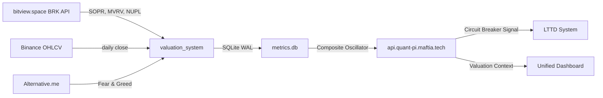
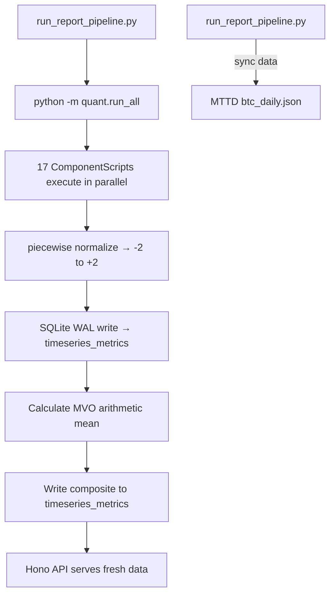

# 01 — Quant BTC Cycle Valuation System

> **Architecture Documentation** · 17-Metric Macro-Economic Cycle Valuation Engine  
> **Tech Stack:** Python 3.10+ · SQLite WAL · Hono v4 (Bun) · React + Vite + TypeScript  
> **Port:** API `:3000` · Frontend `:5173`

---

## 1. Executive Summary

The **Quant BTC Cycle Valuation System** is a statistical quantitative model that aggregates macroeconomic indicators across three pillars to calculate a **Master Valuation Oscillator (MVO)** bounded strictly between `-2` (extreme undervaluation / cycle bottom) and `+2` (extreme overvaluation / cycle peak).

Using piecewise linear interpolation against historical standard-deviation (SD) thresholds, the system converts raw metrics of heterogeneous scales (ratios, scores, percentages) into a unified cycle oscillator, providing long-term investors with clear, real-time macroeconomic context of Bitcoin cycle dynamics.

---

## 2. Three Pillars Architecture

The 17 indicators are organized into three fundamental pillars, following Domain-Driven Design (DDD) ubiquitous language:

### 2.1 Fundamental Pillar (On-Chain & Network Metrics)

| # | Indicator | Source | Description |
|---|-----------|--------|-------------|
| 1 | **MVRV Z-Score** | bitview.space | Market Value to Realized Value — identifies over/undervaluation relative to realized price |
| 2 | **NUPL (Net Unrealized Profit/Loss)** | bitview.space | Aggregate unrealized profit/loss of all holders |
| 3 | **SOPR (Spent Output Profit Ratio)** | bitview.space | Ratio of spent outputs at profit vs. loss |
| 4 | **Stock-to-Flow** | Supply model | Scarcity model based on halving supply reduction |
| 5 | **Active Address Momentum** | bitview.space | Network usage momentum via active address changes |
| 6 | **Exchange Reserve** | bitview.space | BTC held on exchanges (sell pressure proxy) |
| 7 | **Long-Term Holder Supply** | bitview.space | LTH accumulation/distribution cycle detection |

### 2.2 Technical Pillar (Price-Based Metrics)

| # | Indicator | Source | Description |
|---|-----------|--------|-------------|
| 8 | **Pi Cycle Top/Bottom** | Moving average crossovers | Short/long MA crossover timing model |
| 9 | **200-Week Moving Average** | Binance OHLCV | Historical cycle floor indicator |
| 10 | **RHODL Ratio** | bitview.space | Realized HODL Wave — age-weighted profit/loss |
| 11 | **Golden Ratio Multiplier** | Fibonacci of MA | Price relative to 350-day MA × Fibonacci factors |
| 12 | **Bull-Bear Market Cycle** | bitview.space | On-chain cycle classification oscillator |

### 2.3 Sentiment Pillar (Behavioral Metrics)

| # | Indicator | Source | Description |
|---|-----------|--------|-------------|
| 13 | **Fear & Greed Index** | alternative.me | Composite sentiment from volatility, momentum, social |
| 14 | **Google Trends (BTC)** | Google Trends | Search interest as retail participation proxy |
| 15 | **Funding Rate** | Binance | Perpetual futures funding rate (crowding indicator) |
| 16 | **Open Interest Delta** | Binance | Derivatives leverage buildup |
| 17 | **Social Volume** | CryptoQuant/Lunar | Social media mention volume anomaly detection |

---

## 3. Normalization Engine: Piecewise Linear Interpolation `[-2, +2]`

Each raw metric is transformed into a bounded score via piecewise linear interpolation against historical standard-deviation thresholds:

```
  Score Mapping:
  ──────────────────────────────────────
  Raw Value < Mean - 3σ  →  Score = -2.0   (Extreme Bottom)
  Raw Value = Mean - 2σ  →  Score = -1.0   (Undervalued)
  Raw Value = Mean        →  Score =  0.0   (Fair Value)
  Raw Value = Mean + 2σ  →  Score = +1.0   (Overvalued)
  Raw Value > Mean + 3σ  →  Score = +2.0   (Extreme Top)
  ──────────────────────────────────────
```

Custom thresholds per metric are configurable via `metric_config` table in SQLite, allowing per-indicator sensitivity tuning without code changes.

```python
# Piecewise normalization (simplified)
def normalize_value(raw, thresholds):
    """
    thresholds = [(v_neg2, -2), (v_neg1, -1), (v_0, 0), (v_1, +1), (v_2, +2)]
    Linear interpolation between adjacent threshold pairs.
    """
    for i in range(len(thresholds) - 1):
        v_lo, s_lo = thresholds[i]
        v_hi, s_hi = thresholds[i + 1]
        if v_lo <= raw <= v_hi:
            t = (raw - v_lo) / (v_hi - v_lo)
            return s_lo + t * (s_hi - s_lo)
    return clamp(extrapolate(raw, thresholds), -2.0, +2.0)
```

The **Master Valuation Oscillator** is the arithmetic mean of all 17 normalized scores:

```
MVO = (1/17) × Σ Score_i    ∀ i ∈ [1, 17]
```

---

## 4. Storage Layer: SQLite WAL

```sql
-- Time-series normalized scores
CREATE TABLE timeseries_metrics (
    date         TEXT PRIMARY KEY,
    metric_name  TEXT NOT NULL,
    raw_value    REAL,
    normalized   REAL,    -- ∈ [-2.0, +2.0]
    composite    REAL     -- MVO at this date
);

-- Static metric configurations
CREATE TABLE metric_config (
    metric_name  TEXT PRIMARY KEY,
    pillar       TEXT,          -- 'fundamental' | 'technical' | 'sentiment'
    description  TEXT,
    custom_thresholds TEXT,     -- JSON blob of custom thresholds
    enabled      INTEGER DEFAULT 1
);
```

**WAL Mode** provides safe, simultaneous read/write between Python ingestion scripts and the Bun backend — critical since `run_report_pipeline.py` writes data while the API serves it.

---

## 5. API Layer: Hono v4 on Bun Runtime

| Endpoint | Method | Response |
|----------|--------|----------|
| `/api/metrics` | GET | All metric time-series, grouped by pillar |
| `/api/metrics/:name` | GET | Single metric history |
| `/api/composite` | GET | Master Valuation Oscillator time-series |
| `/api/composite/latest` | GET | Current MVO value + interpretation |
| `/api/config` | GET | Metric configurations and custom thresholds |
| `/api/ping` | GET | Health check |

The API dynamically loads metric histories — no hardcoded endpoint growth per metric.

---

## 6. Frontend: React + Vite + Lightweight Charts

### 6.1 Dashboard Components

- **Master Composite Oscillator Chart:** Dual-subplot TradingView chart with log-scale BTC Price + MVO arithmetic mean
- **Three-Pane Synced Detail View:** Per-metric drill-down with:
  - Top: BTC Candlestick OHLC
  - Middle: Raw Metric Value + custom threshold lines
  - Bottom: Normalized valuation score
- **Collapsible Sidebar:** Metrics grouped by DDD pillars (Fundamental, Technical, Sentiment)
- **Interactive Log/Linear Price Scale:** Live scaling on both master and detail charts

### 6.2 Architectural Safeguards

1. **One Component = One Python Script:** Each indicator pipeline is an isolated "Component Playground" script — backtestable independently
2. **Generic API Serving:** API handlers dynamically load metric histories
3. **Decoupled Synchronized Charts:** Time-alignment via strict outer-joins, padding missing intervals for perfect crosshair alignment

---

## 7. Pipeline Integration with Unified System



**Critical Cross-System Role:** The Composite Oscillator feeds into the LTTD System's **Circuit Breaker** — when MVO ≥ `+1.50` (bubble exhaustion), LTTD forces `target_exposure = 0.0` regardless of HMM regime or ensemble score.

---

## 8. Data Flow: Daily Pipeline Execution



---

## 9. Key Design Decisions

| Decision | Rationale |
|----------|-----------|
| Piecewise linear interpolation over sigmoid | Linear preserves ordinal relationships; sigmoid over-smooths at extremes |
| Arithmetic mean (not weighted) | Avoids arbitrary weight optimization; each indicator equally represents one signal |
| SQLite WAL over PostgreSQL | Zero-config deployment; WAL provides sufficient concurrency for single-machine pipeline |
| Custom thresholds per metric | Allows domain expert tuning without code changes; stored in `metric_config` table |
| Component-as-script isolation | Each indicator independently backtestable; decoupled from API serving |
