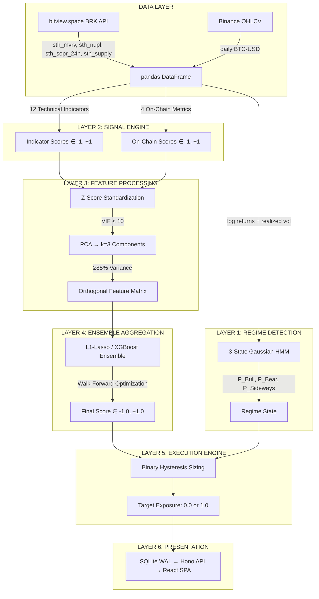
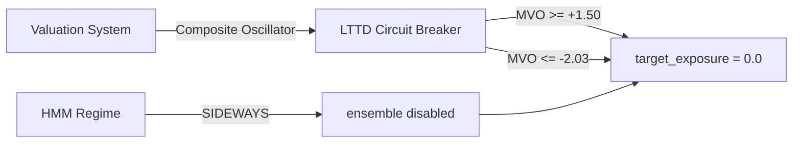

# 02 — Quant BTC LTTD System

> **Architecture Documentation** · Long-Term Trend Direction — Orthogonal Regime-Switching Ensemble  
> **Tech Stack:** Python 3.11+ · scikit-learn · hmmlearn · XGBoost · SQLite WAL · Hono v4 (Bun) · React + Vite  
> **Port:** API `:8765` · Frontend `:8766`

---

## 1. Executive Summary

The **LTTD System** classifies Bitcoin's macro directional bias — **BULL / BEAR / SIDEWAYS** — over a 120–350 day horizon. Built on quantitatively rigorous principles: empirical Ornstein-Uhlenbeck (OU) half-life estimation, PCA orthogonalization, regime-switching Gaussian HMM, and L1-regularized ensemble aggregation.

**Core Principle:** Zero lookahead bias. Every indicator uses `CausalFilter` — only past bars referenced; no symmetric windows. No hardcoded signals. No information leakage.

---

## 2. Six-Layer Architecture



---

## 3. Layer 1 — Regime Detection: 3-State Gaussian HMM

### 3.1 Model

A **3-state Gaussian Hidden Markov Model** trained on daily log returns and 20-day realized volatility:

```python
features = np.column_stack([
    log_returns,           # Daily price changes (log scale)
    realized_vol_20d,      # 20-day annualized realized volatility
])

model = GaussianHMM(
    n_components=3,
    covariance_type="full",
    n_iter=1000
)
```

### 3.2 Regime Classification

| Regime | Characteristics | LTTD Action |
|--------|----------------|-------------|
| **BULL** | High returns, elevated volatility | Full ensemble active, max exposure |
| **BEAR** | Negative returns, high vol, rapid moves | Ensemble active, short bias |
| **SIDEWAYS** | Near-zero returns, low vol, no direction | **Ensemble disabled — zero position** |

> The most expensive mistake in trend-following is paying whipsaw costs during sideways consolidation. The HMM is the circuit breaker.

### 3.3 OU Mean-Reversion Half-Life

Bitcoin's price deviation from its long-term equilibrium follows an Ornstein-Uhlenbeck process:

```
dx_t = θ(μ − x_t)dt + σ dW_t
```

**Half-life estimation via AR(1) regression:**

```
Δx_t = α + β·x_{t-1} + ε_t
θ = -ln(1 + β)
λ = ln(2) / θ
```

| Era | Half-Life | Market Structure |
|-----|-----------|-----------------|
| Pre-2017 | 40–80 days | Retail-driven, high-frequency cycles |
| Post-2020 | 300+ days | Institutional, macro-driven mega-cycles |

**Current epoch: 120–350 days.** Any model using fixed 50/200-day lookbacks will over-trade.

---

## 4. Layer 2 — Signal Engine

### 4.1 Technical Indicators (4 Active, 12 Design Target)

All indicators implement `CausalFilter` — only past bars referenced:

| # | Indicator | Category | Status | Core Logic |
|---|-----------|----------|--------|------------|
| 1 | **Kalman Filtered RSI** | Momentum/Trend | ✅ Active | N-order Kalman on OHLC4 → RSI(250) → normalized |
| 5 | **Adaptive Fourier Supertrend** | Spectral/Trend | ✅ Active | DFT harmonic decomposition → volatility-band trend channel |
| 8 | **Quantile DEMA Supertrend** | Trend/Volatility | ✅ Active | DEMA + percentile ATR bands → directional flip |
| 11 | **VWMA Trend Strength Index** | Volume/Trend | ✅ Active | (Close − VWMA) / ATR → z-scored trend intensity |

### 4.2 On-Chain Metrics (4) — via bitview.space BRK API

No API key required. Live BRK data:

| Series Name | Metric | Bullish Signal |
|-------------|--------|---------------|
| `sth_mvrv` | STH Market Value to Realized Value | < 1.0 |
| `sth_nupl` | STH Net Unrealized Profit/Loss | < 0 |
| `sth_sopr_24h` | STH Spent Output Profit Ratio | Bounce off 1.0 |
| `sth_supply_in_profit` | STH Supply Held at Profit | Low absolute level |

**Lead-lag behavior:** MVRV/NUPL lead price at cycle tops (3–14 days) but coincide/lag at bottoms. Used as **regime filters**, not execution triggers.

---

## 5. Layer 3 — Feature Processing: PCA Orthogonalization

### 5.1 The Problem

12 technical indicators measuring the same underlying momentum signal will have VIF > 10. Simple averaging creates false confidence and synchronized failure during regime transitions.

### 5.2 PCA Pipeline

```python
# Step 1: Z-score standardize
X_std = (X - X.mean(axis=0)) / X.std(axis=0)

# Step 2: Covariance matrix
Σ = (1/n) * X_std.T @ X_std

# Step 3: Eigendecomposition
eigenvalues, eigenvectors = np.linalg.eigh(Σ)

# Step 4: Select top k (≥85% variance)
k = np.argmax(np.cumsum(eigenvalues[::-1]) / eigenvalues.sum() >= 0.85) + 1

# Step 5: Project → orthogonal features
PC = X_std @ eigenvectors[:, -k:]
```

**Result:** First 3 principal components capture >85% variance from 16 input features.

### 5.3 VIF Pruning

Features with **Variance Inflation Factor (VIF) > 10** are dropped before PCA:

```
VIF_j = 1 / (1 - R²_j)
```

### 5.4 Pratt's Relative Importance

After PCA, Pratt's measure identifies which original indicators contribute to PC directions:

```
d_j = β_j · r_j / R²
```

Features with negative or near-zero Pratt measure are pruned.

---

## 6. Layer 4 — Ensemble Aggregation

### 6.1 Models Available

| Mode | Class | Notes |
|------|-------|-------|
| `"xgboost"` (default) | `XGBoostEnsemble` | Default live mode |
| `"lasso"` | `L1LassoEnsemble` | L1-regularized logistic regression |
| `"pca_consensus"` | `PCAConsensusEnsemble` | PCA-weighted voting |

### 6.2 L1-Lasso Logistic Regression

```python
model = LogisticRegression(
    penalty='l1',
    solver='liblinear',
    C=1/lambda_,       # Tuned via WFO
    random_state=42
)
# Target: binary uptrend over next N-day horizon
# Features: PC₁, PC₂, PC₃
model.fit(PC_train, y_train)
```

L1 penalty simultaneously aggregates and prunes — redundant components get β shrunk to exactly zero.

### 6.3 Walk-Forward Optimization (WFO)

```
Fold 1:  [──TRAIN 3yr──][──VAL 6mo──][TEST 6mo]
Fold 2:        [──TRAIN 3yr──][──VAL 6mo──][TEST 6mo]
Fold 3:              [──TRAIN 3yr──][──VAL 6mo──][TEST 6mo]
```

No static in-sample fit. Model parameters update every fold. Reported metrics use only out-of-sample test periods.

---

## 7. Layer 5 — Execution Engine: Binary Hysteresis

### 7.1 Composite Oscillator Circuit Breaker (Tier 1 — Highest Priority)

- **Activate** when `composite_value <= -2.032903` → force `target_exposure = 0.0`
- **Cool-off**: stays at `0.0` until `composite_value > 0.803830`

### 7.2 Score-Based Hysteresis (Tier 2)

- If IN (`prev_exposure >= 0.9`): EXIT when `final_score <= 0.386242`
- If OUT: ENTER when `final_score >= 0.470671`

### 7.3 Deep Value Override (Tier 3)

- If `composite_value >= 2.000613` AND `exposure == 0.0` → force entry `exposure = 1.0`

> Output is always exactly `0.0` or `1.0`. No fractional sizing.

---

## 8. Database Schema (SQLite WAL)

```sql
CREATE TABLE daily_lttd (
    date                   TEXT PRIMARY KEY,
    final_score            REAL,          -- ∈ [-1.0, +1.0]
    regime                 TEXT,          -- 'BULL' | 'BEAR' | 'SIDEWAYS'
    p_bull                 REAL,
    p_bear                 REAL,
    p_sideways             REAL,
    target_exposure        REAL,          -- 0.0 or 1.0
    circuit_breaker_active INTEGER
);

CREATE TABLE indicator_scores (
    date           TEXT,
    indicator_name TEXT,
    score          INTEGER,      -- -1 or +1
    PRIMARY KEY (date, indicator_name)
);

CREATE TABLE onchain_metrics (
    date                   TEXT PRIMARY KEY,
    sth_mvrv               REAL,
    sth_nupl               REAL,
    sth_sopr_24h           REAL,
    sth_supply_in_profit   REAL,
    stamp                  TEXT
);

CREATE TABLE wfo_folds (
    fold_id        INTEGER PRIMARY KEY,
    train_start    TEXT,
    train_end      TEXT,
    test_start     TEXT,
    test_end       TEXT,
    test_accuracy  REAL,
    test_sharpe    REAL,
    lambda_        REAL
);
```

---

## 9. API Endpoints (Hono v4 on `:8765`)

| Endpoint | Description |
|----------|-------------|
| `GET /api/regime` | Current HMM regime + posteriors |
| `GET /api/score` | Final Score time-series |
| `GET /api/score/latest` | Current Final Score + direction |
| `GET /api/indicators` | All active technical indicator scores |
| `GET /api/onchain` | 4 on-chain metrics history |
| `GET /api/pca` | PCA component loadings |
| `GET /api/wfo` | Walk-forward fold results |
| `GET /api/regime/history` | HMM state history |
| `GET /api/ohlc` | BTC daily OHLC |

---

## 10. Interlocking Safeguard with Valuation System



The Valuation System's bubble exhaustion signal (`MVO >= +1.50`) forces LTTD to hold cash regardless of regime or ensemble score — preventing leveraged entries into distribution phases.
