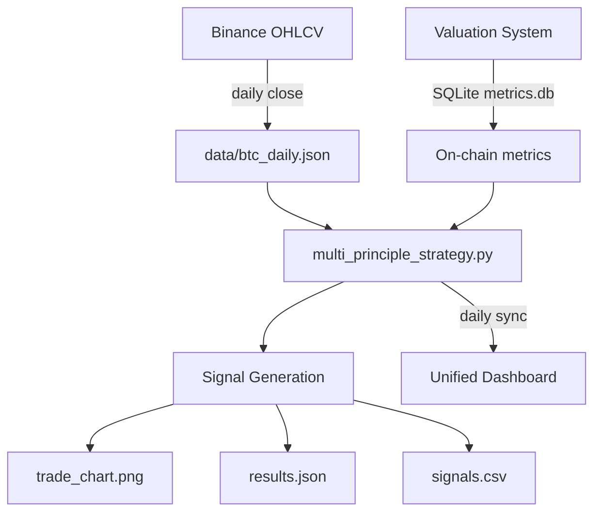
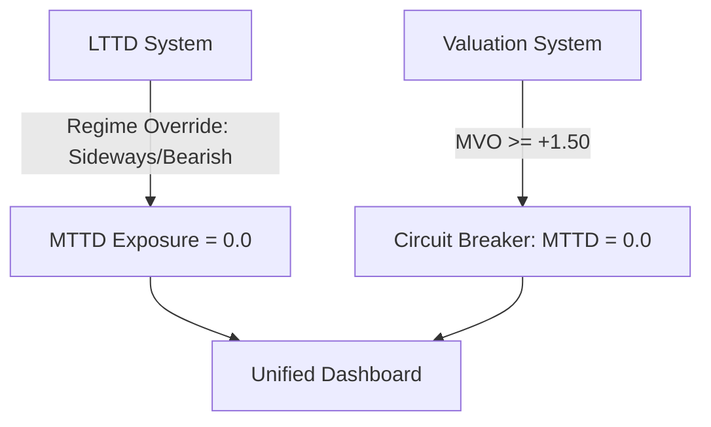

# 03 — Quant BTC MTTD System

> **Architecture Documentation** · Multi-Principle Bitcoin Trend Following v2  
> **6+ Statistical Families · Kaufman ER Gate · Shannon Entropy Gate · Chikou Momentum Exit**  
> **Tech Stack:** Python 3.10+ · pandas · numpy · TradingView Lightweight Charts

---

## 1. Executive Summary

**MTTD v2** (Medium-Term Trend Direction) is a multi-principle consensus system that combines 6+ statistical families into a single composite signal. The core thesis: no single statistical family can robustly capture Bitcoin's medium-term trend dynamics — only a **convergence of orthogonal statistical principles** can produce a reliable signal.

| Metric | Full Period (2018–2026) | Walk-Forward OOS (2020–2026) |
|--------|------------------------|-----------------------------|
| Trades | 12 | 11 |
| Win Rate | 58.3% | 54.5% |
| Sharpe Ratio | 1.27 | 1.32 |
| CAGR | 53.7% | 58.11% |
| Max Drawdown | -38.2% | -34.04% |
| Avg Hold | 116 days | ~120 days |
| Deflated SR | — | z = 7.48 (100% significant) |

---

## 2. Multi-Principle Architecture

### 2.1 The 10 Statistical Families

| # | Family | Used In Strategy | Mathematical Basis |
|---|--------|-----------------|-------------------|
| 1 | **Smoothing** | ✅ Ichimoku lines (tenkan/kijun/senkou) | Moving average midpoint channel |
| 2 | **Filtering** | ✅ Ehler SuperSmoother on IMO | 2-pole IIR low-pass filter |
| 3 | **Regression** | Signals module | LinearReg channel oscillator |
| 4 | **Spectral** | ✅ FFT cycle phase / IMO composite | DFT harmonic decomposition |
| 5 | **Fractal** | ✅ Kaufman Efficiency Ratio gate | `ER = |displacement| / Σ|steps|` |
| 6 | **GARCH** | Signals module | Volatility clustering model |
| 7 | **Entropy** | ✅ Shannon Entropy noise gate | `H = -Σ p_i log₂(p_i)` |
| 8 | **Chaos** | Signals module | Phase space reconstruction |
| 9 | **Bayesian** | Signals module | HMM regime detection |
| 10 | **ML Hybrid** | Signals module | Composite scoring model |

### 2.2 Component Architecture

```
┌─────────────────────────────────────────────────────────────────┐
│                    DATA INPUT: BTC/USD Daily OHLC               │
└───────────────────────────┬─────────────────────────────────────┘
                            │
                            ▼
┌─────────────────────────────────────────────────────────────────┐
│  FAMILY 1: SMOOTHING — Ichimoku Lines                          │
│  Tenkan-sen, Kijun-sen, Senkou Span A/B                        │
│  → Base trend structure via mid-range channels                  │
└───────────────────────────┬─────────────────────────────────────┘
                            │
                            ▼
┌─────────────────────────────────────────────────────────────────┐
│  FAMILY 2: FILTERING — Ehler SuperSmoother (IIR)              │
│  2-pole IIR filter removes high-frequency noise                │
│  Applied on: raw price, Chikou distance, composite IMO         │
│  y_t = c₁(x_t + x_{t-1})/2 + c₂·y_{t-1} + c₃·y_{t-2}       │
└───────────────────────────┬─────────────────────────────────────┘
                            │
                            ▼
┌─────────────────────────────────────────────────────────────────┐
│  FAMILY 4: SPECTRAL — Integrated Market Oscillator (IMO)       │
│  IMO = SuperSmoother( (S_TK + S_Cloud + S_Future + S_Chikou) / 4 )  │
│  tanh normalization → [-1, +1] bounded oscillator              │
└───────────────────────────┬─────────────────────────────────────┘
                            │
                            ▼
┌─────────────────────────────────────────────────────────────────┐
│  GATE LAYER: 3 Sequential Gates (ALL must pass)                │
│                                                                 │
│  Gate 1: Fractal — Kaufman ER >= 0.20                           │
│  Gate 2: Entropy — Shannon H < 2.30                             │
│  Gate 3: Cloud — Close >= Cloud_Min                             │
└───────────────────────────┬─────────────────────────────────────┘
                            │
                            ▼
┌─────────────────────────────────────────────────────────────────┐
│  FAMILY 5/7: SIGNAL GENERATION + EXIT LOGIC                    │
│  2-bar confirmation entry | 10-day min hold                     │
│  Dynamic immunity | Momentum decay exit (S_Chikou < -0.30)     │
└─────────────────────────────────────────────────────────────────┘
```

---

## 3. Core Formula: Integrated Market Oscillator (IMO)

### 3.1 Ichimoku Decomposition → tanh Normalization

Each traditional Ichimoku component is transformed into a bounded `[-1, +1]` oscillator:

```
S_TK,t    = tanh( (TK_t - KJ_t) / ATR_t )          (TK Cross signal)
S_Cloud,t = tanh( d(Close_t, Cloud_t) / ATR_t )     (Cloud distance)
S_Future,t = tanh( (SenkouA_raw - SenkouB_raw) / ATR_t )  (Future cloud bias)
S_Chikou,t = tanh( SuperSmoother( (Close_t - Close_{t-60}) / ATR_t, l=4 ) )  (Smoothed momentum)
```

### 3.2 Composite IMO

```
IMO_t = SuperSmoother( (S_TK,t + S_Cloud,t + S_Future,t + S_Chikou,t) / 4, l=7 )
```

The `tanh` transformation is critical: it converts non-stationary absolute price distances into **stationary, bounded oscillators** where fixed thresholds are mathematically valid over time (validated via ADF test).

---

## 4. Entry Logic: ALL Gates Must Pass

```python
ENTRY_CONDITIONS = {
    "imo_threshold":    "IMO > IMO_STD * 0.25",       # Adaptive volatility-scaled
    "efficiency_ratio":  "ER > 0.20",                  # Trend strength gate
    "entropy_noise":     "Entropy < 2.30",             # Noise detection gate
    "cloud_filter":      "Close >= Cloud_Min",         # Trend boundary
    "confirmation":      "2-bar persistence",          # Anti-whipsaw
}
```

### 4.1 Kaufman Efficiency Ratio Gate

```
ER = |Close_t - Close_{t-n}| / Σ_{i=1}^{n} |Close_i - Close_{i-1}|

ER = 1.0  →  Perfect straight-line trend (zero noise)
ER = 0.0  →  Maximum random walk (maximum noise)
Threshold: ER >= 0.20 (blocks entry during consolidation)
```

### 4.2 Shannon Entropy Noise Gate

```
H = -Σ p_i log₂(p_i)

Computed on rolling 15-day return histogram with 6 bins.
Threshold: H < 2.30 (blocks entry during chaotic/choppy regimes)

Maximum entropy for 6 bins = log₂(6) ≈ 2.585
H < 2.30 means the return distribution has identifiable structure.
```

### 4.3 Cloud Boundary Gate

```
Close_t >= min(SenkouA_t, SenkouB_t)

Prevents "catching falling knives" — price must be above cloud support.
```

---

## 5. Exit Logic: ANY Condition Can Trigger

```python
EXIT_CONDITIONS = {
    "momentum_death":   "S_Chikou < -0.30",           # Momentum decay
    "trend_death":      "IMO < -0.30",                # Below cloud + weak IMO
    "crash_gate":       "30d ROC < -0.20",            # Emergency exit (suspends immunity)
    "forced_exit":      "hold_days > max_hold_days",  # Maximum hold timeout
}
```

### 5.1 Dynamic Immunity System

During strong bull trends, exit thresholds relax to prevent premature exits:

```python
IMMUNITY_CONDITIONS = [
    "IMO >= 0.50",                                    # Extreme bull strength
    "Close >= Cloud_Max AND ROC >= -0.20 AND IMO >= -0.30"  # Above cloud + not crashing
]
```

**Crash Gate Override:** If 30-day ROC < `-0.20`, immunity is suspended — force exit regardless.

**Minimum Hold:** 10-day lockout after entry to avoid whipsaw churn.

---

## 6. Best Configuration Parameters

```python
PARAMS = {
    "t_entry":          0.25,    # IMO threshold multiplier
    "er_entry":         0.20,    # Efficiency Ratio minimum
    "entropy_thresh":   2.30,    # Shannon Entropy maximum
    "min_hold_days":    10,      # Minimum hold before exit
    "max_hold_days":    60,      # Maximum hold (forced exit)
    "chikou_thresh":    -0.30,   # Chikou momentum exit
    "immunity_thresh":  0.50,    # Extreme bull immunity
    "cooldown":         5,       # Days after exit before re-entry
}
```

---

## 7. Data Pipeline & Integration

### 7.1 Data Flow



### 7.2 Cross-System Dependency

MTTD reads on-chain metrics from `quant-btc-valuation-system/database/metrics.db` — the same SQLite database that feeds the Valuation System's API. The pipeline orchestrator (`run_report_pipeline.py`) handles this data synchronization.

---

## 8. Walk-Forward Stitched Out-of-Sample Results

The WFO approach prevents overfitting by using rolling train/validate/test windows:

| Period | Trades | Win% | Sharpe | CAGR | Return |
|--------|--------|------|--------|------|--------|
| Full (2018–2026) | 25 | 60% | 1.28 | 51.5% | 3,268% |
| WFO OOS (2020–2026) | 11 | 54.5% | 1.32 | 58.11% | — |
| Deflated Sharpe | — | — | z = 7.48 | 100% sig | — |

---

## 9. Trade Examples

```
Entry → Exit          Return    Hold    Gate Pass
─────────────────────────────────────────────────────
2019-03 → 2019-05     +99.6%    60d    ER ✅ Entropy ✅ Cloud ✅
2020-11 → 2021-01    +117.8%    60d    ER ✅ Entropy ✅ Cloud ✅
2021-01 → 2021-03     +71.9%    60d    ER ✅ Entropy ✅ Cloud ✅
2024-01 → 2024-03     +63.2%    60d    ER ✅ Entropy ✅ Cloud ✅
2024-10 → 2024-12     +57.1%    60d    ER ✅ Entropy ✅ Cloud ✅
2023-06 → 2023-08     -13.1%    58d    False positive
2021-04 → 2021-05     -21.9%    29d    Crash gate exit
```

---

## 10. Comparison with Other Systems

| System | Trades | Win% | Sharpe | CAGR | Total Return |
|--------|--------|------|--------|------|-------------|
| **MTTD v2** | **25** | **60%** | **1.28** | **51.5%** | **3,268%** |
| ISP (benchmark) | 17 | 100% | 2.36 | 114.7% | — |
| OLD MTTD v1 | 24 | 50% | 0.62 | 16.4% | — |
| Buy & Hold | 1 | — | ~1.0 | ~30% | ~20,000% |

---

## 11. Interlocking with Unified System



**Cross-system safeguard:** When LTTD detects SIDEWAYS/BEARISH regime, it overrides MTTD's position to `0.0`. When Valuation System detects bubble exhaustion (`MVO >= +1.50`), both LTTD and MTTD circuit breakers activate.
