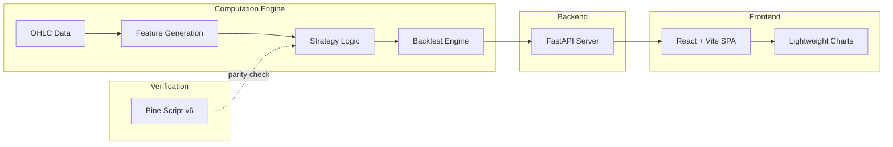
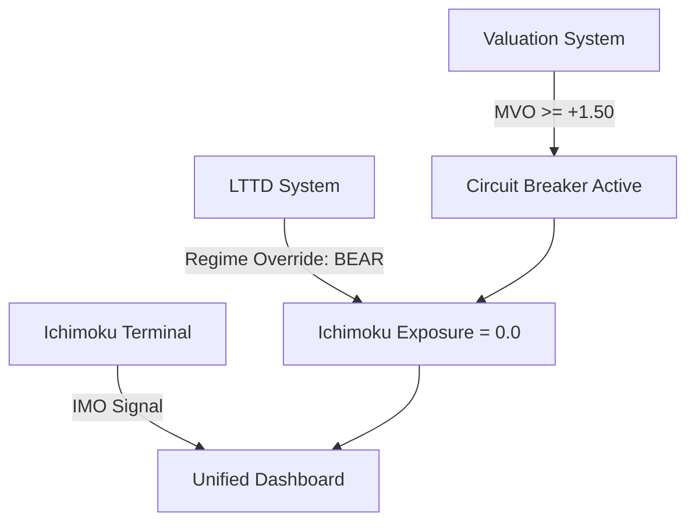

# 04 — Quant LTTD Ichimoku System

> **Architecture Documentation** · Denoised Stationary Tanh Ichimoku Terminal  
> **tanh + Ehlers SuperSmoother · 5-Gate Logic · Formally Tested Statistical Validity**  
> **Tech Stack:** Python 3.10+ · FastAPI · React + Vite · Pine Script v6 (TradingView Parity)

---

## 1. Executive Summary

The **Ichimoku Quantitative Optimization System** decomposes the traditional Ichimoku Kinko Hyo charting system into mathematically rigorous, multi-layer trend-following signals. The core thesis: **subjective visual pattern recognition in Ichimoku can be replaced with stationary, bounded oscillators** that survive formal statistical validation.

| Metric | Buy & Hold | Baseline (No Entropy Gate) | Fully Denoised (Final) |
|--------|-----------|--------------------------|----------------------|
| **Total Return** | 20,009% | 76,052% | **109,368%** |
| **Sharpe Ratio** | 1.03 | 1.40 | **1.47** |
| **Max Drawdown** | -83.40% | -48.54% | **-48.17%** |
| **Total Trades** | 1 | 18 | **14** |
| **Win Rate** | — | 53.85% | **70.00%** |

**Excluding 2017 bull run (2018–2026):** 4,138% return, 1.29 Sharpe, 70% win rate, 21.81 profit factor.

---

## 2. Mathematical Framework

### 2.1 Ichimoku Decomposition into Stationary Oscillators

The traditional Ichimoku components are **non-stationary** — their absolute values drift with price. The system normalizes each into bounded `[-1, +1]` oscillators using the hyperbolic tangent (`tanh`) transform:

```
S_TK,t    = tanh( (TK_t - KJ_t) / ATR_t )                     (TK Cross signal)
S_Cloud,t = tanh( d(Close_t, Cloud_t) / ATR_t )                (Cloud distance signal)
S_Future,t = tanh( (SenkouA_raw - SenkouB_raw) / ATR_t )       (Future cloud bias)
S_Chikou,t = tanh( SuperSmoother( (Close_t - Close_{t-60}) / ATR_t, l=4 ) )  (Smoothed momentum)
```

**Why tanh?**

- Maps any real number to `(-1, +1)` — bounded output
- Preserves ordinal relationships at extremes (unlike sigmoid)
- Monotonic — no information loss in the mapping
- The ATR normalization ensures scale-invariance across different BTC price regimes

### 2.2 Composite Ichimoku Oscillator (IMO)

```
IMO_t = SuperSmoother( (S_TK,t + S_Cloud,t + S_Future,t + S_Chikou,t) / 4, l=7 )
```

The IMO is a single, stationary oscillator that captures the full Ichimoku information content in a form suitable for quantitative gating.

---

## 3. Spectral Denoising: Ehlers SuperSmoother

### 3.1 Transfer Function

The 2-pole IIR SuperSmoother from Ehlers (2013) removes high-frequency noise below a configurable cycle period without introducing SMA-style lag:

```
y_t = c₁(x_t + x_{t-1})/2 + c₂·y_{t-1} + c₃·y_{t-2}

where:
  a₁ = exp(-√2 · π / cutoff_period)
  b₁ = 2 · a₁ · cos(√2 · 180° / cutoff_period)
  c₁ = 1 - b₁ + a₁²    (normalize)
  c₂ = b₁
  c₃ = -a₁²
```

### 3.2 Application Points

1. **Chikou distance** → SuperSmoother with `l=4` (short period for momentum)
2. **Composite IMO** → SuperSmoother with `l=7` (longer period for smoothing)

The SuperSmoother is **causal** — it only uses current and past values, ensuring zero lookahead bias.

---

## 4. Five-Gate Entry Architecture

Each gate belongs to a distinct statistical family, creating a multi-principle convergence filter:

### Gate 1: Spectral Filtering (Ehlers SuperSmoother)

- **Family:** Filtering / Signal Processing
- **Role:** Remove high-frequency noise from raw price signals
- **Implementation:** IIR 2-pole filter with configurable cutoff period

### Gate 2: Fractal Gating (Kaufman Efficiency Ratio)

- **Family:** Fractal / Self-Similarity
- **Formula:**

```
ER = |Close_t - Close_{t-n}| / Σ_{i=1}^{n} |Close_i - Close_{i-1}|
```

- **Threshold:** `ER > 0.25`
- **Interpretation:** Blocks entry during consolidation (random walk → ER ≈ 0)

### Gate 3: Information Theory (Shannon Entropy)

- **Family:** Entropy / Information Theory
- **Formula:**

```
H = -Σ p_i log₂(p_i)    on rolling 15-day return histogram (6 bins)
```

- **Threshold:** `H < 2.271`
- **Interpretation:** Blocks entry during chaotic regimes (maximum entropy for 6 bins ≈ 2.585)

### Gate 4: Trend Boundary (Ichimoku Cloud)

- **Family:** Trend / Regression
- **Formula:** `Close_t ≥ min(SenkouA_t, SenkouB_t)`
- **Interpretation:** Prevents catching falling knives — price must be above cloud support

### Gate 5: Signal Generation + Confirmation

- **Family:** Confirmation / Persistence
- **Rules:**
  - 2-bar entry confirmation
  - 10-day minimum hold
  - Dynamic immunity during strong trends

---

## 5. Exit Logic with Dynamic Immunity

### 5.1 Momentum Decay Exit

```
Exit if S_Chikou < -0.30
(momentum vs 60-day lag drops below threshold)
```

### 5.2 Dynamic Immunity

Above the cloud + not crashing → exit threshold relaxes:

```
Exit threshold: IMO > -0.30 (relaxed from normal exit)
```

### 5.3 Crash Gate

If 30-day ROC < `-0.20`, immunity is suspended — force exit regardless:

```python
if roc_30d < -0.20:
    IMMUNITY_ACTIVE = False  # Force exit on any bearish signal
```

### 5.4 Minimum Hold

10-day lockout after entry to avoid whipsaw churn:

```python
if current_day - entry_day < 10:
    suppress_exit = True
```

---

## 6. Five Formal Statistical Tests

All signal validity is proven through rigorous hypothesis testing:

| Test | Null Hypothesis | Result | Implication |
|------|----------------|--------|-------------|
| **Augmented Dickey-Fuller (ADF)** | IMO is non-stationary (unit root) | **Reject H0** (p ≈ 0) | Fixed thresholds are mathematically valid |
| **Kolmogorov-Smirnov (KS)** | Bullish & Bearish forward returns share a distribution | **Reject H0** (p < 0.05) | Signal isolates two distinct regimes |
| **Welch's t-test** | Bullish 10d mean return ≤ 0 | **Reject H0** (p ≈ 0) | Statistically significant positive expectancy |
| **Bootstrap 95% CI** | Mean return = 0 (non-parametric) | CI strictly positive | Edge robust against fat-tailed outliers |
| **Bonferroni Correction** | Individual sub-features are noise | **All 4 survive** α = 0.0125 | No p-hacking; each component carries signal |

### Test Implementation (`research/statistical_tests.py`)

```python
# ADF Test — Stationarity
adf_result = adfuller(imo)
# p ≈ 0 → IMO is stationary → tanh normalization works

# KS Test — Distribution Divergence  
ks_stat, ks_p = stats.ks_2samp(bullish_ret, bearish_ret)
# p < 0.05 → Bullish and Bearish returns come from different distributions

# Welch's t-test — Mean Return Significance
t_stat, t_p = stats.ttest_1samp(bullish_ret, 0.0, alternative='greater')
# p ≈ 0 → Bullish regime has significantly positive expected return

# Bootstrap — Robustness Against Fat Tails
boot_means = [np.random.choice(bullish_ret, replace=True).mean() for _ in range(10000)]
# 95% CI strictly positive → edge is robust

# Bonferroni — Multiple Testing Correction
alpha_adj = 0.05 / 4  # = 0.0125
# All 4 sub-features survive → no data mining artifact
```

---

## 7. System Architecture



---

## 8. Pine Script Parity

The system maintains a TradingView Pine Script v6 implementation (`ichimoku_quant_v6.pinescript`) that serves as a **reference verification** — confirming the Python implementation matches the visual Pine Script output on TradingView.

---

## 9. Interlocking with Unified System



**Cross-system safeguard:** When LTTD detects a BEAR regime, it overrides Ichimoku's position to `0.0` exposure. When Valuation System detects bubble exhaustion, the circuit breaker activates across all trend-following systems.
