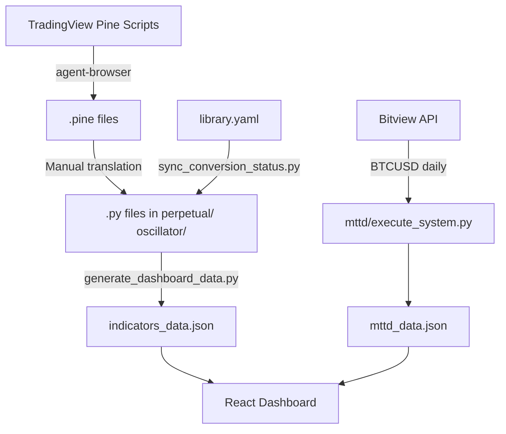
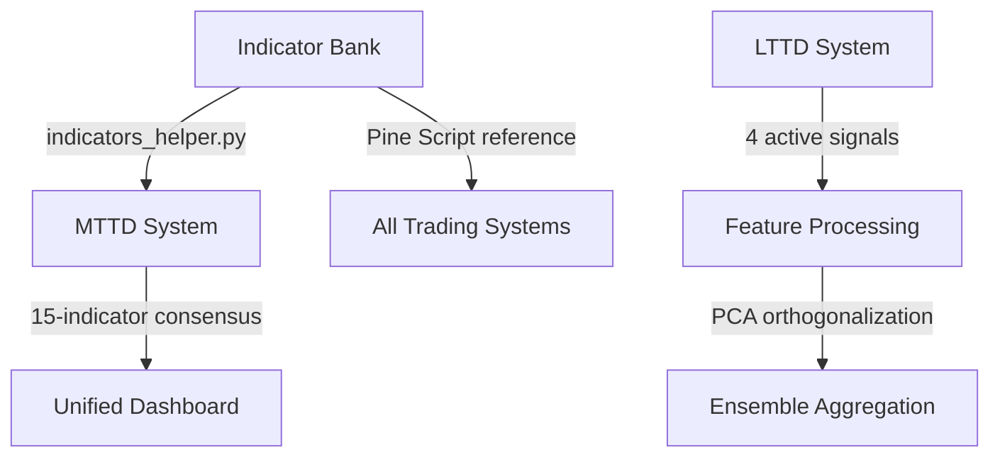

# 05 — Quant Technical Indicator Bank

> **Architecture Documentation** · Pine Script Scraper · Core Vectorized Library · 10 Statistical Families · Indicator Registry  
> **Tech Stack:** Python 3.8+ · agent-browser (Bun) · React + TypeScript · TradingView Lightweight Charts v5

---

## 1. Executive Summary

The **Quant Technical Indicator Bank** is a comprehensive, production-grade quant library and interactive visualization system comprising:

1. An automated **Pine Script scraping engine** powered by `agent-browser`
2. A vectorized **Python indicator translation library** matching Pine Script logic bar-by-bar
3. A **React TypeScript Dashboard** for real-time indicator visualization
4. A **MTTD Consensus Engine** using 15 non-repainting trend-following indicators in a majority-vote ensemble

---

## 2. Pine Script Scraper Engine (`agent-browser`)

### 2.1 Architecture

```
┌──────────────────────────────────────────────────────────────┐
│                   agent-browser (Bun)                        │
│                                                              │
│  1. Launch headless Chromium via Playwright                   │
│  2. Navigate to TradingView Pine Script source page          │
│  3. Extract code from Monaco Editor DOM                      │
│  4. Save to local .pine files                                │
│  5. Update library.yaml registry status                      │
└──────────────────────────────────────────────────────────────┘
```

### 2.2 Scraping Workflow

```bash
# Install agent-browser
bun install -g agent-browser
agent-browser install

# Run scraper
python3 tmp/scrape.py
```

The scraper processes indicators listed in `library.yaml`, fetching Pine Script source code from TradingView's Monaco Editor interface. Each indicator's `fetched`/`unfetched` status is tracked in the registry.

---

## 3. Core Vectorized Library (`indicators_helper.py`)

The centralized library provides **exact vectorized counterparts** for Pine Script's built-in functions, ensuring bar-by-bar equivalence:

### 3.1 Moving Averages

| Function | Description | Pine Script Equivalent |
|----------|-------------|----------------------|
| `sma(source, length)` | Simple Moving Average | `ta.sma()` |
| `ema(source, length)` | Exponential Moving Average | `ta.ema()` |
| `wma(source, length)` | Weighted Moving Average | `ta.wma()` |
| `hma(source, length)` | Hull Moving Average | `ta.hma()` |
| `dema(source, length)` | Double EMA | `ta.dema()` |
| `tema(source, length)` | Triple EMA | `ta.tema()` |
| `t3(source, length)` | T3 Moving Average | `ta.t3()` |
| `alma(source, length)` | Arnaud Legoux MA | `ta.alma()` |
| `frama(source, length)` | Fractal Adaptive MA | `ta.frama()` |
| `vwma(source, length)` | Volume-Weighted MA | `ta.vwma()` |

### 3.2 Range & Oscillators

| Function | Description | Pine Script Equivalent |
|----------|-------------|----------------------|
| `tr(high, low, close)` | True Range | `ta.tr()` |
| `atr(high, low, close, length)` | Average True Range | `ta.atr()` |
| `rsi(source, length)` | Relative Strength Index | `ta.rsi()` |
| `sar(high, low)` | Parabolic SAR | `ta.sar()` |
| `cci(high, low, close, length)` | Commodity Channel Index | `ta.cci()` |
| `cmo(source, length)` | Chande Momentum Oscillator | `ta.cmo()` |
| `mfi(high, low, close, volume, length)` | Money Flow Index | `ta.mfi()` |
| `mom(source, length)` | Momentum | `ta.mom()` |

### 3.3 Logic & Math

| Function | Description | Pine Script Equivalent |
|----------|-------------|----------------------|
| `nz(series, replacement)` | Replace NaN with value | `nz()` |
| `crossover(s1, s2)` | Cross above detection | `ta.crossover()` |
| `crossunder(s1, s2)` | Cross below detection | `ta.crossunder()` |
| `highest(source, length)` | Rolling maximum | `ta.highest()` |
| `lowest(source, length)` | Rolling minimum | `ta.lowest()` |
| `linreg(source, length)` | Linear regression | `ta.linreg()` |
| `valuewhen(condition, source, nth)` | Value at Nth occurrence | `ta.valuewhen()` |
| `barssince(condition)` | Bars since condition | `ta.barssince()` |
| `pivothigh(source, left, right)` | Pivot high detection | `ta.pivothigh()` |
| `pivotlow(source, left, right)` | Pivot low detection | `ta.pivotlow()` |

### 3.4 Stateful Loop Handling

Pine Script's stateful variables (`var`, `varip`, `:=` reassignments) are translated into **optimized sequential bar-by-bar logic** inside Python functions to prevent lookahead bias:

```python
def rma(source, length):
    """Running Moving Average — Pine Script's rma() equivalent.
    Uses sequential loop to maintain state across bars."""
    alpha = 1.0 / length
    rma_vals = pd.Series(index=source.index, dtype=float)
    rma_vals.iloc[0] = source.iloc[0]
    for i in range(1, len(source)):
        rma_vals.iloc[i] = alpha * source.iloc[i] + (1 - alpha) * rma_vals.iloc[i-1]
    return rma_vals
```

---

## 4. Indicator Registry (`library.yaml`)

Master configuration database tracking all indicators:

```yaml
- indicator: DEMA RSI Overlay
  author: BackQuant
  link: https://www.tradingview.com/script/YJ1WIIFb-DEMA-RSI-Overlay-BackQuant/
  status: fetched              # fetched | unfetched | script not available
  conversion_status: converted # converted | unconverted | not applicable

- indicator: Kalman Filter RSI
  author: quant-lutfi
  status: fetched
  conversion_status: converted
```

### 4.1 Registry Management

```bash
# Sync library.yaml with physical files on disk
python3 tmp/sync_conversion_status.py

# Compile all indicators into dashboard JSON database
python3 tmp/generate_dashboard_data.py
```

---

## 5. 10 Statistical Families

The Indicator Bank provides implementations across 10 distinct statistical families:

| # | Family | Indicators | Mathematical Basis |
|---|--------|-----------|-------------------|
| 1 | **Smoothing** | SMA, EMA, WMA, HMA, DEMA, TEMA, ALMA, Frama, VWMA | Moving average variants with different weighting kernels |
| 2 | **Filtering** | Ehlers SuperSmoother, Kalman Filter, Savitzky-Golay (causal only) | IIR/FIR digital signal processing filters |
| 3 | **Regression** | LinearReg, R² channel, Quantile Regression | OLS and robust regression for trend/slope estimation |
| 4 | **Spectral** | FFT, DFT, Wavelet, Cycle Phase | Frequency-domain decomposition of price cycles |
| 5 | **Fractal** | Kaufman Efficiency Ratio, Hurst Exponent, Fractal Dimension | Self-similarity and scaling behavior of price series |
| 6 | **GARCH** | GARCH(1,1), EGARCH, GJR-GARCH | Conditional heteroscedasticity modeling |
| 7 | **Entropy** | Shannon Entropy, Approximate Entropy, Sample Entropy | Information-theoretic measures of randomness |
| 8 | **Chaos** | Phase Space Reconstruction, Lyapunov Exponent, Recurrence | Nonlinear dynamics and deterministic chaos detection |
| 9 | **Bayesian** | HMM (Gaussian), Bayesian Regression, Kalman | Probabilistic inference and state-space models |
| 10 | **ML Hybrid** | XGBoost, L1-Lasso, Random Forest, Ensemble Voting | Machine learning augmented signal generation |

---

## 6. MTTD Consensus System

### 6.1 15 Indicator Majority-Vote Ensemble

The MTTD system within the Indicator Bank uses 15 selected non-repainting indicators:

```bash
# Execute the consensus calculation
python3 mttd/execute_system.py
```

**Architecture:**

1. Fetch daily BTCUSD data from Bitview API (since 2018-01-01)
2. Run all 15 indicators in vectorized form
3. Aggregate signals using majority-vote consensus
4. Calculate buy/sell entry/exit points
5. Export data to `mttd_data.json`

### 6.2 Dashboard Visualization

When running the dashboard, the MTTD Consensus tab displays:

1. **BTCUSD Price Chart:** Candlestick with system buy/sell marker overlays
2. **Consensus Strength (Net Vote):** Area chart from -15 to +15 (emerald green = bullish, rose red = bearish)
3. **15 Individual Signals:** Baseline charts showing regime shifts per indicator

---

## 7. React TypeScript Dashboard

### 7.1 Technology Stack

- **React 19** with TypeScript (strict mode)
- **Vite** for build tooling and HMR
- **TradingView Lightweight Charts v5.2.0** for financial plotting
- **Bun** as package manager

### 7.2 Dashboard Features

- **Real-time indicator visualization** over interactive charts
- **MTTD Consensus tab** with synchronized multi-chart view
- **Vertical Cursor Synchronization:** Crosshair mouse movement syncs vertical timescale line across all charts
- **Y-Axis Width Lock:** Right price axis locked to minimum `85px` for perfect grid alignment

### 7.3 Key UX Innovations

#### Vertical Crosshair Synchronization

```
┌──────────────┬──────────────┬──────────────┐
│   Chart 1    │   Chart 2    │   Chart 3    │
│      │       │      │       │      │       │
│      │  ←────┼──────┼───────┼──────│       │
│      │       │      │       │      │       │
└──────────────┴──────────────┴──────────────┘
     Mouse on Chart 1 → All charts show same time marker
```

All charts share a synchronized vertical crosshair — moving the mouse on any chart updates the time marker across the entire dashboard simultaneously.

#### 85px Y-Axis Width Lock

```
┌──────────────┬────┐  ← Fixed 85px right axis width
│   Chart 1    │$62k│
├──────────────┤    │  ← Perfect vertical grid alignment
│   Chart 2    │$63k│
├──────────────┤    │
│   Chart 3    │$64k│
└──────────────┴────┘
```

All right-side price axes are locked to a minimum width of 85px, ensuring horizontal grid lines align perfectly across stacked charts.

---

## 8. Data Pipeline



---

## 9. Interlocking with Unified System



The Indicator Bank serves as the **foundational library** — its vectorized implementations (`indicators_helper.py`) are consumed by MTTD and can be extended to support the 12 technical indicators planned for LTTD's design target.
